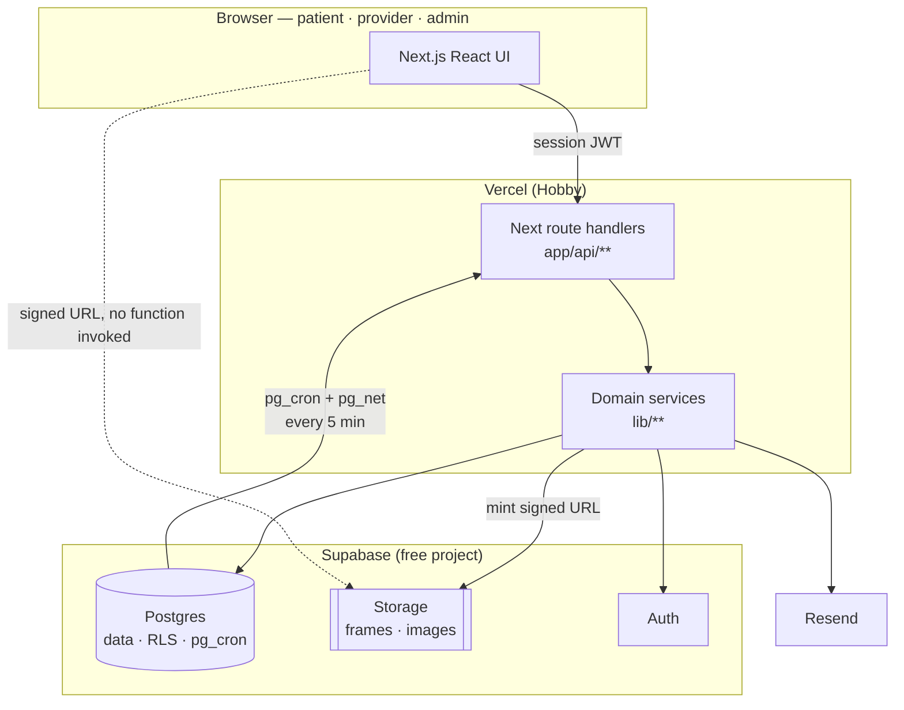

# Architecture — Patient Imaging, Reports & Scheduling Portal

Every decision closed in `docs/adr/`, folded into one shape, plus **the pinned
seams**: the exact contracts that more than one ticket touches.

A surface named in no document of record is decided by whichever lane starts
first. Everything below is named here so that cannot happen. If a ticket needs a
shape this document does not carry, that is a phase-1 escape — close it here
first, then write the ticket.

- **What must be true:** `REQUIREMENTS.md`
- **Why the shapes are what they are:** `docs/adr/`
- **What words mean:** `CONTEXT.md`

---

## 1 · System shape



The dotted edge is ADR-0003's whole point: PHI bytes never cross a route
handler. Authorization and audit happen once, on the solid path; the bytes come
from the storage CDN.

---

## 2 · Module map

Ownership, layering, and what may not import what. This is a **pinned seam** —
a ticket that creates a module outside this map is out of scope.

```
app/
  (patient)/…                UI · patient flows
  (provider)/…               UI · provider + admin flows
  s/[token]/…                UI · share-link landing (unauthenticated)
  api/**                     route handlers — the API surface

lib/
  config.ts                  reads + validates env; the ONLY reader of process.env
  db/client.ts               the ONLY module constructing a Supabase client
  access/guard.ts            session + unlock + ownership + audit, in one call
  access/identity.ts         FR-2 verification, attempts, lockout
  imaging/studies.ts         studies, images, clips, manifests
  imaging/signing.ts         mints signed Storage URLs
  reports/reports.ts         report reads, signed-only predicate
  reports/ReportView.tsx     the ONE report renderer (viewer + share)
  scheduling/availability.ts working hours, blocks, slot generation
  scheduling/booking.ts      book, reschedule, cancel — owns the transaction
  scheduling/lifecycle.ts    FR-14 status transitions
  share/links.ts             mint, resolve, revoke
  notify/email.ts            the ONLY caller of Resend
  audit/events.ts            the ONLY writer to audit_events
  time/zones.ts              instant ↔ zone conversion

db/
  migrations/                committed SQL migrations (CQ-6)
  seed/                      seed script + synthetic asset generator

tests/                       Vitest — unit + integration
e2e/                         Playwright
k6/                          load scripts
scripts/gate.sh              the repo's own definition of done
```

### Forbidden imports

Each line is mechanically checkable, and a lint rule enforces it.

| Rule | Why |
|------|-----|
| `lib/**` must not import from `app/**` | Domain logic stays testable without a request. |
| Only `lib/config.ts` reads `process.env` | One place validates the environment contract (§8). |
| Only `lib/db/client.ts` imports `@supabase/supabase-js` | One place decides anon key vs service role. |
| Only `lib/audit/events.ts` writes `audit_events` | SEC-4's append-only guarantee has one enforcement point. |
| Only `lib/notify/email.ts` imports the Resend SDK | GAP-3's log-only fallback cannot be bypassed. |
| No `app/api/**` handler touching PHI may skip `lib/access/guard.ts` | The guard *is* the authorization and the audit write (§5). |
| Only `lib/imaging/signing.ts` mints signed Storage URLs | One TTL, one place. |
| `lib/reports/ReportView.tsx` is the only report renderer | FR-7 and FR-8 cannot diverge in formatting. |

---

## 3 · Data model — pinned schema

Executed against a real Postgres before publication; see §13.

```sql
create type slot_status         as enum ('open', 'booked');
create type appointment_status  as enum ('requested','confirmed','completed','cancelled','no_show');
create type report_status       as enum ('preliminary','signed');
create type visit_status        as enum ('scheduled','completed','cancelled');
create type actor_kind          as enum ('account','share_recipient','system');

-- ── people ──────────────────────────────────────────────────────────────
create table patients (
  id              uuid primary key default gen_random_uuid(),
  user_id         uuid unique references auth.users(id) on delete set null,
  patient_ref     text not null unique,          -- typed at FR-2; NOT a sequence
  date_of_birth   date not null,
  full_name       text not null,
  email           text not null,
  created_at      timestamptz not null default now()
);

create table providers (
  id              uuid primary key default gen_random_uuid(),
  user_id         uuid unique references auth.users(id) on delete set null,
  full_name       text not null,
  time_zone       text not null,                 -- IANA, e.g. 'America/Chicago'
  slot_minutes    int  not null default 30 check (slot_minutes between 5 and 240),
  created_at      timestamptz not null default now()
);

create table staff_admins (
  id              uuid primary key default gen_random_uuid(),
  user_id         uuid unique references auth.users(id) on delete cascade,
  created_at      timestamptz not null default now()
);

-- ── FR-2 identity verification ──────────────────────────────────────────
create table identity_unlocks (
  id              uuid primary key default gen_random_uuid(),
  user_id         uuid not null references auth.users(id) on delete cascade,
  patient_id      uuid not null references patients(id) on delete cascade,
  unlocked_at     timestamptz not null default now(),
  expires_at      timestamptz not null,
  revoked_at      timestamptz
);
create index on identity_unlocks (user_id, expires_at desc);

create table identity_attempts (
  id                    uuid primary key default gen_random_uuid(),
  attempted_patient_ref text not null,           -- as typed; never resolved
  source_ref            text not null,           -- coarse client identifier
  user_id               uuid references auth.users(id) on delete set null,
  succeeded             boolean not null,
  attempted_at          timestamptz not null default now()
);
create index on identity_attempts (attempted_patient_ref, attempted_at desc);
create index on identity_attempts (source_ref, attempted_at desc);

-- ── imaging ─────────────────────────────────────────────────────────────
create table visits (
  id              uuid primary key default gen_random_uuid(),
  patient_id      uuid not null references patients(id) on delete cascade,
  provider_id     uuid not null references providers(id),
  occurred_at     timestamptz not null,
  status          visit_status not null,
  created_at      timestamptz not null default now()
);
create index on visits (patient_id, status);

create table studies (
  id              uuid primary key default gen_random_uuid(),
  visit_id        uuid not null references visits(id) on delete cascade,
  patient_id      uuid not null references patients(id) on delete cascade,
  description     text not null,
  created_at      timestamptz not null default now()
);
create index on studies (patient_id);

create table images (
  id              uuid primary key default gen_random_uuid(),
  study_id        uuid not null references studies(id) on delete cascade,
  patient_id      uuid not null references patients(id) on delete cascade,
  storage_key     text not null,                 -- random UUID path, ADR-0003
  thumb_key       text,                          -- EL-1
  width           int  not null,
  height          int  not null,
  ordinal         int  not null,
  unique (study_id, ordinal)
);

create table cine_clips (
  id              uuid primary key default gen_random_uuid(),
  study_id        uuid not null references studies(id) on delete cascade,
  patient_id      uuid not null references patients(id) on delete cascade,
  frame_count     int  not null check (frame_count between 1 and 100),
  default_fps     int  not null default 12 check (default_fps between 1 and 60),
  poster_key      text,                          -- EL-1 first-frame thumbnail
  created_at      timestamptz not null default now()
);

create table cine_frames (
  clip_id         uuid not null references cine_clips(id) on delete cascade,
  frame_index     int  not null check (frame_index >= 0),
  storage_key     text not null,
  primary key (clip_id, frame_index)
);

-- ── reports (ADR-0007) ──────────────────────────────────────────────────
create table reports (
  id              uuid primary key default gen_random_uuid(),
  study_id        uuid not null references studies(id) on delete cascade,
  patient_id      uuid not null references patients(id) on delete cascade,
  status          report_status not null,
  findings        text not null,
  impression      text not null,
  signed_by       uuid references providers(id),
  signed_at       timestamptz,
  created_at      timestamptz not null default now(),
  constraint signed_fields_present check (
    (status = 'signed'      and signed_by is not null and signed_at is not null) or
    (status = 'preliminary' and signed_by is null     and signed_at is null)
  )
);
create index on reports (patient_id, status);

-- ── scheduling ──────────────────────────────────────────────────────────
create table working_hours (
  id              uuid primary key default gen_random_uuid(),
  provider_id     uuid not null references providers(id) on delete cascade,
  weekday         int  not null check (weekday between 0 and 6),  -- 0 = Sunday
  starts_local    time not null,
  ends_local      time not null,
  check (ends_local > starts_local),
  unique (provider_id, weekday)
);

create table availability_blocks (
  id              uuid primary key default gen_random_uuid(),
  provider_id     uuid not null references providers(id) on delete cascade,
  starts_at       timestamptz not null,
  ends_at         timestamptz not null,
  reason          text,
  check (ends_at > starts_at)
);

create table slots (
  id              uuid primary key default gen_random_uuid(),
  provider_id     uuid not null references providers(id) on delete cascade,
  starts_at       timestamptz not null,
  ends_at         timestamptz not null,
  status          slot_status not null default 'open',
  unique (provider_id, starts_at)
);
create index on slots (provider_id, starts_at) where status = 'open';

create table appointments (
  id               uuid primary key default gen_random_uuid(),
  slot_id          uuid not null references slots(id),
  patient_id       uuid not null references patients(id) on delete cascade,
  provider_id      uuid not null references providers(id),
  status           appointment_status not null default 'requested',
  out_of_hours     boolean not null default false,   -- ADR-0006
  idempotency_key  text,                             -- EC-10
  created_at       timestamptz not null default now(),
  updated_at       timestamptz not null default now()
);

-- FR-12 backstop: at most one live appointment per slot, whatever the app does.
create unique index appointments_one_live_per_slot
  on appointments (slot_id)
  where status in ('requested','confirmed');

-- EC-10: a retried submit resolves to the same appointment.
create unique index appointments_idempotency
  on appointments (patient_id, idempotency_key)
  where idempotency_key is not null;

create table appointment_transitions (
  id              uuid primary key default gen_random_uuid(),
  appointment_id  uuid not null references appointments(id) on delete cascade,
  from_status     appointment_status,
  to_status       appointment_status not null,
  actor_user_id   uuid references auth.users(id),
  occurred_at     timestamptz not null default now()
);

-- ── sharing (FR-5, FR-8) ────────────────────────────────────────────────
create table share_links (
  id              uuid primary key default gen_random_uuid(),
  token_hash      text not null unique,          -- sha256; raw token never stored
  resource_kind   text not null check (resource_kind in ('image','report')),
  resource_id     uuid not null,
  patient_id      uuid not null references patients(id) on delete cascade,
  created_by      uuid not null references auth.users(id),
  recipient_email text not null,
  expires_at      timestamptz not null,
  revoked_at      timestamptz,
  created_at      timestamptz not null default now()
);
create index on share_links (patient_id, created_at desc);

-- ── reminders (FR-15, EC-9) ─────────────────────────────────────────────
create table reminder_sends (
  appointment_id  uuid not null references appointments(id) on delete cascade,
  lead_hours      int  not null,
  sent_at         timestamptz,
  attempted_at    timestamptz not null default now(),
  outcome         text not null check (outcome in ('sent','failed','skipped')),
  primary key (appointment_id, lead_hours)      -- EC-9: idempotency, structural
);

-- ── audit (SEC-4) ───────────────────────────────────────────────────────
create table audit_events (
  id              bigserial primary key,
  occurred_at     timestamptz not null default now(),
  actor_kind      actor_kind not null,
  actor_ref       text,                          -- user id or share_link id
  action          text not null,                 -- see the closed set below
  target_kind     text not null,
  target_id       uuid,
  outcome         text not null check (outcome in ('granted','denied')),
  detail          jsonb                          -- never PHI (SEC-6)
);
create index on audit_events (occurred_at desc);
create index on audit_events (actor_ref, occurred_at desc);
```

### Pinned: the closed set of audit actions

Two tickets writing `image.view` and `image_viewed` produce a log nobody can
query. These strings are the contract.

```
identity.verify        identity.lockout
study.view             image.view            clip.view
report.view
share.create           share.use             share.revoke
booking.create         booking.reschedule    booking.cancel
appointment.transition
availability.update    availability.collision
reminder.dispatch
```

`outcome` is `granted` or `denied`. **A denial is audited too** — FR-6 and FR-9
require rejected attempts to be logged, so the guard writes on the way out of a
failure, not only on success.

### Append-only, structurally

The application role gets `INSERT` and `SELECT` on `audit_events` and nothing
else. This is a **grant**, not a convention, and it is what makes SEC-4's
append-only claim true:

```sql
revoke all on audit_events from public;
grant select, insert on audit_events to app_user;
-- deliberately NOT granted: update, delete
grant usage, select on sequence audit_events_id_seq to app_user;
```

Verified by execution (§13): `UPDATE` and `DELETE` both fail with
`insufficient_privilege` for the application role. The `bigserial` sequence grant
is easy to forget and makes every insert fail without it.

---

## 4 · Row-level security

RLS is the second layer behind the application checks, not a replacement for
them (ADR-0002). Application code still verifies ownership explicitly; RLS is
what catches the handler that forgets.

A helper resolves the caller's patient:

```sql
create or replace function current_patient_id() returns uuid
language sql stable security definer set search_path = public as $$
  select id from patients where user_id = auth.uid()
$$;
```

Policy shape, applied to `studies`, `images`, `cine_clips`, `cine_frames`,
`visits`, `reports`, `appointments`:

```sql
alter table studies enable row level security;

create policy studies_own on studies for select
  using (patient_id = current_patient_id());

-- FR-7: the signed-only rule is a predicate, not a convention.
create policy reports_own_signed on reports for select
  using (patient_id = current_patient_id() and status = 'signed');
```

Provider policies key on `provider_id = current_provider_id()`. Share-link reads
run through the service role after `lib/share/links.ts` has validated the token —
RLS cannot see a share recipient, which is exactly why the token check lives in
one module.

---

## 5 · The access guard — the single PHI seam

Every PHI route calls this. It is the authorization *and* the audit write, so a
handler cannot have one without the other.

```ts
// lib/access/guard.ts
export type Actor =
  | { kind: 'account'; userId: string }
  | { kind: 'share_recipient'; shareLinkId: string }

export type PhiTarget =
  | { kind: 'study';  id: string }
  | { kind: 'image';  id: string }
  | { kind: 'clip';   id: string }
  | { kind: 'report'; id: string }

export type GuardResult =
  | { ok: true;  patientId: string }
  | { ok: false; status: 401 | 403 | 404 }

/**
 * Verifies session, identity unlock, and ownership; writes exactly one
 * audit event either way. Never throws for an authorization failure —
 * the caller maps `status` straight to a response.
 *
 * Ownership failure returns 404, never 403: a 403 confirms the resource
 * exists, which is itself a cross-patient leak under FR-6.
 */
export async function guardPhiAccess(
  actor: Actor,
  target: PhiTarget,
  action: AuditAction,
): Promise<GuardResult>
```

Status meanings, pinned so three tickets do not invent three conventions:

| Situation | Status |
|-----------|--------|
| No session, or expired session | `401` |
| Session valid, no live identity unlock | `403` with `{ error: 'identity_unlock_required' }` |
| Unlock live but for a different patient | `404` |
| Resource belongs to another patient | `404` |
| Resource does not exist | `404` |
| Report exists but is `preliminary` | `404` |

---

## 6 · Wire shapes

Request and response for every endpoint. A field not listed here does not
exist. All timestamps are RFC 3339 with an explicit offset.

**Error envelope — every non-2xx response, without exception:**

```jsonc
{ "error": "snake_case_code", "message": "Human-readable, never PHI." }
```

### Identity — FR-2, EC-1

```
POST /api/identity/verify
  → { "patientRef": "PT-4471", "dateOfBirth": "1988-03-14" }
  ← 200 { "unlockedUntil": "2026-08-14T18:45:00Z" }
  ← 400 { "error": "identity_mismatch", "message": "…" }     ← also the lockout response
```

One response for a wrong reference, a wrong date of birth, and an active
lockout. No field-level detail, no "locked" hint (ADR-0008).

```
GET  /api/identity/status
  ← 200 { "unlocked": true, "unlockedUntil": "…" } | { "unlocked": false }
```

### Imaging — FR-3, FR-4

```
GET /api/studies
  ← 200 { "studies": [ { "id","description","occurredAt","imageCount","clipCount" } ] }
```

Completed visits only (FR-3), and only the caller's own.

```
GET /api/studies/:studyId
  ← 200 {
      "id","description","occurredAt",
      "images": [ { "id","width","height","ordinal","url","thumbUrl","expiresAt" } ],
      "clips":  [ { "id","frameCount","defaultFps","posterUrl" } ]
    }
```

```
GET /api/studies/:studyId/clips/:clipId
  ← 200 {
      "id","frameCount","defaultFps",
      "frames": [ { "index": 0, "url": "https://…", "available": true } ],
      "expiresAt": "…"
    }
```

**`available: false` is EC-2.** A frame whose object is missing is returned with
`available: false` and no `url`. The viewer shows a gap indicator and keeps
playing. The manifest never 500s because one frame is gone.

### Reports — FR-7

```
GET /api/reports
  ← 200 { "reports": [ { "id","studyId","studyDescription","signedAt" } ] }

GET /api/reports/:reportId
  ← 200 {
      "id","studyId","studyDescription",
      "patientRef","findings","impression",
      "signedByName","signedAt"
    }
  ← 404 for a preliminary report — never 403
```

### Sharing — FR-5, FR-8, EC-5

```
POST /api/shares
  → { "resourceKind": "image" | "report", "resourceId": "uuid",
      "recipientEmail": "dr@example.com" }
  ← 201 { "id","expiresAt","recipientEmail" }

GET    /api/shares                 ← 200 { "shares": [ { "id","resourceKind","resourceId",
                                                        "recipientEmail","expiresAt",
                                                        "revokedAt","state" } ] }
DELETE /api/shares/:id             ← 204                        (revoke)

GET /api/s/:token
  ← 200 { "resourceKind","payload": { … }, "expiresAt" }
  ← 410 { "error": "share_unavailable", "message": "This link is no longer available." }
```

`state` is `active | expired | revoked`. **Expired and revoked are
indistinguishable to the recipient** — both are `410 share_unavailable`, and an
unknown token returns the same thing. Anything else confirms the link once
existed (EC-5).

### Availability — FR-10, EC-8

```
GET   /api/providers/:providerId/availability
  ← 200 { "timeZone": "America/Chicago", "slotMinutes": 30,
          "workingHours": [ { "weekday": 1, "startsLocal": "09:00", "endsLocal": "17:00" } ],
          "blocks": [ { "id","startsAt","endsAt","reason" } ] }

PATCH /api/providers/:providerId/availability
  → { "slotMinutes": 30,
      "workingHours": [ … ],
      "blocks": [ { "startsAt","endsAt","reason" } ] }
  ← 200 { "removedOpenSlots": 14,
          "generatedOpenSlots": 22,
          "preservedOutOfHours": [ { "appointmentId","startsAt","endsAt","patientRef" } ] }
```

Accept-and-flag (ADR-0006). Never 409 on a booked collision.

### Booking — FR-11, FR-12, FR-13, EC-7, EC-10

```
GET  /api/slots?providerId=…&from=…&to=…
  ← 200 { "slots": [ { "id","startsAt","endsAt" } ] }        open + future only

POST /api/appointments
  → { "slotId": "uuid", "idempotencyKey": "client-generated-uuid" }
  ← 201 { "id","slotId","startsAt","endsAt","status":"requested","providerName" }
  ← 409 { "error": "slot_unavailable",
          "message": "That slot is no longer available." }
```

```
  ← 409 { "error": "idempotency_key_reused",
          "message": "That request key was already used for a different slot." }
```

`409 slot_unavailable` is the exact loser response for EC-7 and FR-12. A repeat
POST with the **same** `idempotencyKey` **and the same `slotId`** returns `200`
with the original appointment — not a second 201, and not a 409 (EC-10). The
same key against a *different* slot is `409 idempotency_key_reused`, never a
silent no-op (§10).

```
GET   /api/appointments
  ← 200 { "appointments": [ { "id","startsAt","endsAt","status","providerName",
                              "outOfHours","canChange","changeDeadline" } ] }

PATCH /api/appointments/:id
  → { "action": "reschedule", "slotId": "uuid" }
  → { "action": "cancel" }
  → { "action": "transition", "status": "confirmed" | "completed" | "no_show" }
  ← 200 { … the appointment … }
  ← 409 { "error": "slot_unavailable",       … }
  ← 422 { "error": "minimum_notice",         "message": "Changes are not allowed within 24 hours of the appointment." }
  ← 422 { "error": "invalid_transition",     "message": "…" }
```

`canChange` and `changeDeadline` exist so the UI never has to re-derive the FR-13
notice rule client-side and drift from the server.

### Health and jobs

```
GET  /api/health
  ← 200 { "app": "ok", "database": "ok" | "down", "storage": "ok" | "down" }
       200 even when a dependency is down — the body carries the state (CQ-3).

POST /api/jobs/reminders          header: x-cron-secret
  ← 200 { "due": 12, "sent": 12, "skipped": 0, "failed": 0 }
  ← 401 when the secret is absent or wrong
```

---

## 7 · URL map

| Path | Who | Requirement |
|------|-----|-------------|
| `/` | anyone | landing |
| `/register`, `/login` | anonymous | FR-1 |
| `/verify` | signed-in patient | FR-2 |
| `/studies` | unlocked patient | FR-3 |
| `/studies/[studyId]` | unlocked patient | FR-3 · image viewer, zoom/pan |
| `/studies/[studyId]/clips/[clipId]` | unlocked patient | FR-4 · cine viewer |
| `/reports` | unlocked patient | FR-7 |
| `/reports/[reportId]` | unlocked patient | FR-7 |
| `/shares` | unlocked patient | FR-5, FR-8 · list + revoke |
| `/s/[token]` | **anonymous recipient** | FR-5, FR-8, EC-5 |
| `/appointments` | patient | FR-11, FR-13, FR-14 |
| `/book` | patient | FR-11 |
| `/provider/schedule` | provider | FR-10, FR-14 |
| `/provider/availability` | provider | FR-10, EC-8 |
| `/admin/audit` | admin | SEC-4 |

`/s/[token]` is the only PHI-bearing page reachable without a session. It is
`noindex`, and it never renders anything beyond the one shared resource.

---

## 8 · Environment contract

Every variable, its default, and its reader. `lib/config.ts` is the only module
reading `process.env`; it validates at startup and fails loudly rather than
letting a missing value surface as a runtime null. All of these appear in
`.env.example` with placeholder values only (SEC-7).

| Variable | Default | Read by | Notes |
|----------|---------|---------|-------|
| `NEXT_PUBLIC_SUPABASE_URL` | — | `lib/db/client.ts` | required |
| `NEXT_PUBLIC_SUPABASE_ANON_KEY` | — | `lib/db/client.ts` | required |
| `SUPABASE_SERVICE_ROLE_KEY` | — | `lib/db/client.ts` | required · **server only, never `NEXT_PUBLIC_`** |
| `APP_BASE_URL` | `http://localhost:4310` | `lib/share/links.ts`, `lib/notify/email.ts` | share links are absolute |
| `RESEND_API_KEY` | — | `lib/notify/email.ts` | absent ⇒ transport falls back to `log` (GAP-3) |
| `RESEND_FROM` | — | `lib/notify/email.ts` | verified sender |
| `EMAIL_TRANSPORT` | `resend` | `lib/notify/email.ts` | `resend` \| `log` |
| `CRON_SECRET` | — | `app/api/jobs/reminders` | required in deployed environments |
| `SHARE_LINK_TTL_HOURS` | `48` | `lib/share/links.ts` | ADR-0008 |
| `MIN_CHANGE_NOTICE_HOURS` | `24` | `lib/scheduling/booking.ts` | ADR-0008 |
| `REMINDER_LEAD_HOURS` | `24` | reminder job | ADR-0008 |
| `IDENTITY_UNLOCK_TTL_MINUTES` | `45` | `lib/access/identity.ts` | ADR-0008 |
| `IDENTITY_MAX_ATTEMPTS` | `3` | `lib/access/identity.ts` | ADR-0008 |
| `IDENTITY_LOCKOUT_MINUTES` | `5` | `lib/access/identity.ts` | ADR-0008 |
| `SIGNED_URL_TTL_SECONDS` | `300` | `lib/imaging/signing.ts` | ADR-0003 |
| `SEED_SOURCE_SEED` | `patient-imaging-portal` | `db/seed/**` | deterministic assets (ADR-0009) |
| `PORT` | `4310` | Next dev/start | §9 |
| `TEST_PG_PORT` | `54310` | test harness | §9 |

---

## 9 · Host substrate

The machine is a shared surface. Sibling worktrees, sibling builds, and other
projects contend for it, so **no bare well-known port appears anywhere** — not
in a compose file, not in a test fixture, not in a script default. The collision
is temporal: whoever boots second loses, and running the file once proves
nothing.

| Resource | Value | Rule |
|----------|-------|------|
| App listen port | `PORT`, default **4310** | never `3000` |
| Test Postgres | `TEST_PG_PORT`, default **54310** | never `5432` |
| Test container name | `pip-testpg-${TEST_PG_PORT}` | port-namespaced, so two worktrees never collide |
| Playwright base URL | derived from `PORT` | never hardcoded |
| Test fixtures that listen | **bind port 0**, pass the assigned port to the client | no fixed port, ever |
| Supabase Storage bucket | `phi` | one bucket, private, no public policy |

---

## 10 · Booking concurrency — FR-12, EC-7, EC-10

Two independent mechanisms. The index is what makes the guarantee true; the lock
is what makes the loser's error clean rather than a constraint violation.

```sql
-- book(slot_id, patient_id, idempotency_key)
begin;

  -- 1. EC-10: a retry short-circuits before anything is locked.
  select * from appointments
   where patient_id = $2 and idempotency_key = $3;
  -- found → commit and return it with 200.

  -- 2. FR-12: take the row lock. Losers block here, then see 'booked'.
  select id from slots
   where id = $1 and status = 'open'
   for update;
  -- 0 rows → rollback, 409 slot_unavailable.

  insert into appointments (slot_id, patient_id, provider_id, idempotency_key)
  values ($1, $2, (select provider_id from slots where id = $1), $3);
  -- appointments_one_live_per_slot is the backstop if the lock logic is ever wrong.

  update slots set status = 'booked' where id = $1;

  insert into appointment_transitions (appointment_id, to_status, actor_user_id)
  values (…, 'requested', …);

commit;
```

**Reschedule locks both slots in a fixed order.** Two patients swapping slots in
opposite directions deadlock otherwise:

```sql
select id from slots
 where id in ($old, $new)
 order by id            -- deterministic order — this line prevents the deadlock
   for update;
```

Then free the old slot and take the new one in the same transaction, so FR-13's
"frees the old slot atomically" holds.

**A unique-violation is never surfaced raw.** Both indexes map to their wire
error: `appointments_one_live_per_slot` → `409 slot_unavailable`,
`appointments_idempotency` → re-read and return `200`. An unhandled `23505` in a
response is a CQ-3 failure.

**The idempotency short-circuit must check the slot, not just the key.** Execution
(§13) showed the obvious form is too permissive: keyed on `(patient_id,
idempotency_key)` alone, a retry carrying the same key but a **different** slot
returns the original appointment and silently books nothing. A client bug then
looks like success. So step 1 compares the stored appointment's `slot_id` to the
requested one:

| Retry | Response |
|-------|----------|
| same key, same slot | `200` with the original appointment |
| same key, **different** slot | `409 idempotency_key_reused` |

`idempotency_key_reused` is a pinned wire error (§6) precisely because it is
invisible without this check.

**The cancelled-slot case is why the index is partial.** Verified by execution: a
`cancelled` appointment on a slot does **not** block a later live appointment on
that same slot, so FR-13's "the freed slot becomes bookable again" works with
the constraint in place rather than against it.

---

## 11 · Time and zones — EC-6

- Every instant is `timestamptz`. There is no naive local timestamp anywhere in
  the schema, and none in a wire shape.
- A provider carries an **IANA zone**. `working_hours` are *local* wall-clock
  times in that zone, which is what makes DST work at all — 09:00 stays 09:00
  through a transition.
### Slot generation walks instants, never local wall-clock times

This is the single most important line in this document, and it was **wrong in
the first draft**. Execution caught it (§13).

```sql
-- CORRECT. Walk instants across a padded window, keep the ones whose
-- LOCAL time falls inside working hours for that local date.
select gs as starts_at
from generate_series(
       (d::timestamp - interval '1 day') at time zone tz,
       (d::timestamp + interval '2 days') at time zone tz,
       (slot_minutes || ' minutes')::interval
     ) gs
where (gs at time zone tz)::date  = d
  and (gs at time zone tz)::time >= starts_local
  and (gs at time zone tz)::time <  ends_local;
```

**Why the obvious approach is broken.** Generating each local wall-clock time and
converting it — `(d + t)::timestamp at time zone tz` — fails on both transitions:

| Day (America/Chicago, 00:00–06:00, 30-min slots) | Local-walk | Instant-walk | Correct |
|---|---|---|---|
| 2026-03-07 · normal | 12 slots | 12 slots | 12 |
| 2026-03-08 · spring forward | 12 rows, **10 distinct instants — 2 collisions** | 10 slots | 10 |
| 2026-11-01 · fall back | 12 slots | 14 slots | 14 |

On spring-forward, local `02:00` and `03:00` both resolve to `2026-03-08
08:00:00+00`. Postgres shifts a nonexistent local time forward rather than
rejecting it, so the generator does not fail loudly — it produces a duplicate
that the `unique (provider_id, starts_at)` constraint then rejects mid-run:

```
ERROR: duplicate key value violates unique constraint
DETAIL: Key (starts_at)=(2026-03-08 08:00:00+00) already exists.
```

On fall-back the same approach silently generates **12 slots where 14 exist** —
the repeated 01:00–02:00 local hour is real bookable time, and it is dropped with
no error at all. That is the "skipped" failure EC-6 names, and nothing catches it.

The instant-walk handles both without a special case: a nonexistent local time
has no instant that maps to it, and a repeated local hour has two instants that
both pass the filter.

**Constraint on the padding.** The ±1 day window must exceed the largest UTC
offset in use. The `::date = d` filter is what keeps neighbouring days out.

**Constraint on alignment.** Stepping from an aligned base stays on the slot grid
only while offset changes are whole multiples of `slot_minutes`. That holds for
every whole-hour DST zone. A 30-minute-offset zone (`Australia/Lord_Howe`) would
break alignment; the seed and the provider form restrict `time_zone` to
whole-hour-DST zones, and this is stated rather than assumed.
- The UI renders every instant in the **viewer's** zone with the zone
  abbreviation shown, and a slot the patient is booking additionally shows the
  provider's local time. EC-6 asks for unambiguous display on both sides.

---

## 12 · Reminders — FR-15, EC-9, PF-8

```
pg_cron  every 5 minutes
   └─ pg_net POST  {APP_BASE_URL}/api/jobs/reminders   header x-cron-secret
         └─ select appointments where
              status in ('requested','confirmed')
              and starts_at between now() + interval '24 hours'
                              and now() + interval '24 hours' + interval '30 minutes'
         └─ for each: insert into reminder_sends (appointment_id, lead_hours, outcome)
              on conflict do nothing            ← EC-9 lives here
         └─ only rows this transaction actually inserted are emailed
```

**Idempotency is the primary key, not the schedule.** `reminder_sends`'s
composite key `(appointment_id, lead_hours)` means a second run, an overlapping
run, and a retried run all insert zero rows and send zero emails. The job is safe
to run every minute or every hour; correctness does not depend on the cadence.

The insert happens **before** the send, so a crash mid-send loses a reminder
rather than duplicating one — the direction PF-8 tolerates ("0 duplicates" is
absolute; "≥99% sent" has slack). A `failed` outcome is recorded and retried on
the next pass by clearing that row, which is the one place a delete is allowed.

The email body carries **no PHI** — a generic notice plus a link (SEC-9).

---

## 13 · Execution status of code-shaped artifacts

Schemas, SQL and state machines in a spec read as verified and are not. The
following are **executed against a real Postgres**, at a scale where the defect
class can appear, with more rows available than the operation should touch:

Executed **2026-08-14** against PostgreSQL 16 (`postgres:16-alpine`, port 54310
per §9), with a 16,000-slot dataset — more rows available than any operation
below should touch.

| Artifact | Executed | Result |
|----------|:--------:|--------|
| §3 schema + §4 policies, full DDL | ✅ | Applies clean on stock Postgres 16 with `auth.users` / `auth.uid()` stubbed. |
| §10 booking under **20 concurrent bookers** on the last open slot, released by a common time barrier | ✅ | **1 booked, 19 `conflict`.** FR-12, PF-7, EC-7 hold. |
| §10 bound check — did it touch more than it should? | ✅ | 1 appointment, 1 slot booked, **15,999 still open**, 1 transition row. |
| §10 `appointments_one_live_per_slot` backstop, bypassing the lock entirely | ✅ | Rejected with `unique_violation`. The guarantee survives a wrong lock. |
| §10 partial index vs a rebooked cancelled slot (FR-13, EC-11) | ✅ | A `cancelled` appointment does not block a new live one on the same slot. |
| §10 EC-10 idempotent retry | ✅ | Second call returns the original appointment; one row for the key. **Also exposed the same-key-different-slot hole** — fix folded into §10 and §6. |
| §10 reschedule deadlock, two opposite swaps | ✅ | **Unordered locking deadlocks** (one session killed). `ORDER BY id … FOR UPDATE` — both succeed. The ordering line is load-bearing. |
| §11 DST slot generation, spring forward + fall back | ✅ | **Found a real defect.** Local-walk collides on 2026-03-08 and drops 2 slots on 2026-11-01. Instant-walk gives 12 / 10 / 14. §11 rewritten. |
| §12 reminder idempotency across three consecutive runs | ✅ | 3 sent, then 0, then 0. Three rows total. EC-9 holds structurally. |
| §4 RLS — each patient enumerating all study ids | ✅ | Each sees exactly their own; zero cross-patient rows. FR-6, FR-9. |
| §4 RLS — preliminary report visible to its own patient? | ✅ | Not visible. FR-7's signed-only rule holds at the database. |
| §3 audit append-only under the application role | ✅ | `UPDATE` and `DELETE` both `insufficient_privilege`. SEC-4. |

**Two defects were found by running these, and neither was visible by reading.**
The DST generator would have failed a migration mid-run in March and silently
under-generated in November; the idempotency short-circuit would have turned a
client bug into a phantom success.

**Anything edited after this date is re-executed**, however small the edit.

---

## 14 · Test hooks

E2E selectors are a seam: the ticket that builds a component and the ticket that
tests a flow both touch them. Pinned names, `data-testid`:

```
identity-form · identity-error
study-list · study-card · image-viewer · image-zoom
cine-viewer · cine-play · cine-next · cine-prev · cine-fps · cine-frame-gap
report-view · report-findings · report-impression
share-create · share-list · share-revoke · share-unavailable
slot-list · slot-item · book-submit · booking-conflict
appointment-list · appointment-item · appointment-out-of-hours
availability-form · availability-collision-list
```

---

## 15 · Gate tiers

Tier → command, resolved by `scripts/gate.sh <tier>`. CI and every lane run the
same runner, so they cannot drift.

| Tier | Runs |
|------|------|
| `docs` | markdown lint + link check |
| `logic` | `tsc --noEmit`, eslint, `vitest run` |
| `api` | `logic` + integration tests against a migrated test database |
| `ui` | `api` + `playwright test` |

`scripts/gate.sh` is a **repo-bootstrap-epic deliverable** and must merge before
any ticket carrying a tier that invokes it.

---

## 16 · Known residues

Stated here rather than discovered later.

- **Signed URLs outlive revocation** by up to `SIGNED_URL_TTL_SECONDS` (ADR-0003).
  Bounded by the short TTL and disclosed in the README's SEC-8 section.
- **Audit granularity is the access grant**, not the byte range (ADR-0003).
  Stated in the README rather than left to inference.
- **Shared pool assets warm caches** more than production would (ADR-0009).
  Benchmarks use distinct assets per virtual user where the k6 script can
  arrange it; the README says so.
- **SEC-7's hashing is delegated** to Supabase Auth, so it is documented rather
  than readable in this repo (ADR-0004).
