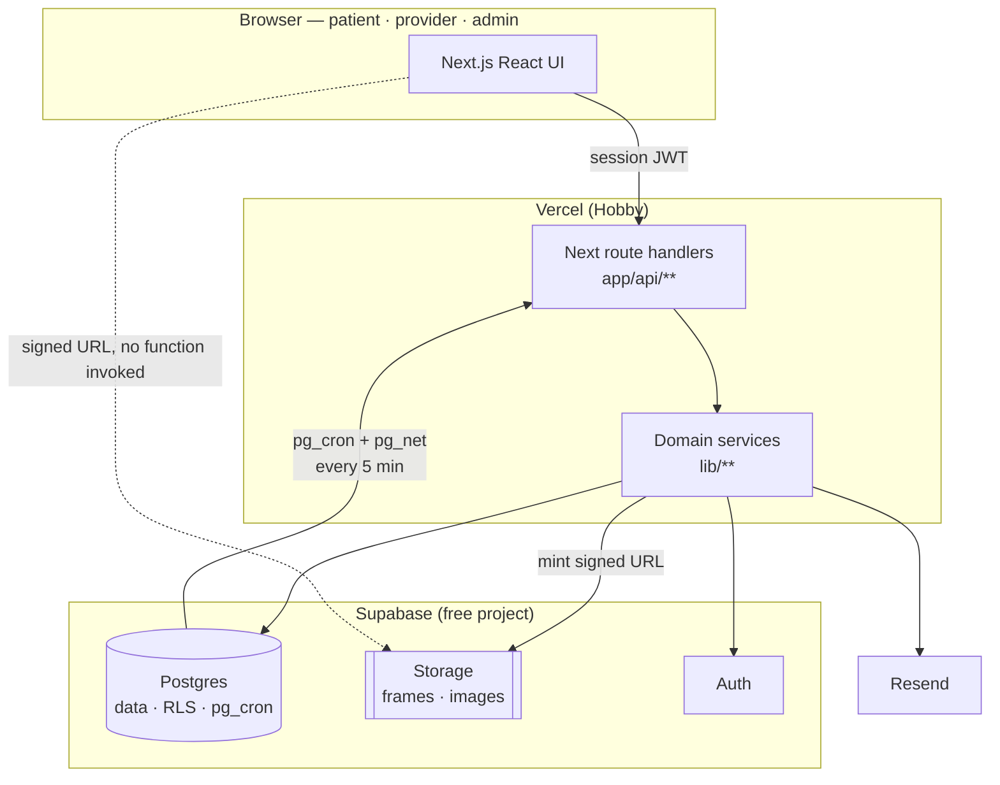

# Architecture — Patient Imaging, Reports & Scheduling Portal

Every decision closed in `docs/adr/`, folded into one shape, plus **the pinned
seams**: the exact contracts that more than one ticket touches.

A surface named in no document of record is decided by whichever lane starts
first. Everything below is named here so that cannot happen. If a ticket needs a
shape this document does not carry, that is a phase-1 escape — close it here
first, then write the ticket.

- **What must be true:** `REQUIREMENTS.md`
- **Why the shapes are what they are:** `docs/adr/`
- **What words mean:** `CONTEXT.md`

---

## 1 · System shape



The dotted edge is ADR-0003's whole point: PHI bytes never cross a route
handler. Authorization and audit happen once, on the solid path; the bytes come
from the storage CDN.

---

## 2 · Module map

Ownership, layering, and what may not import what. This is a **pinned seam** —
a ticket that creates a module outside this map is out of scope.

```
app/
  (patient)/…                UI · patient flows
  (provider)/…               UI · provider + admin flows
  s/[token]/…                UI · share-link landing (unauthenticated)
  api/**                     route handlers — the API surface

lib/
  config.ts                  reads + validates env; the ONLY reader of process.env
  validation/                request-body schemas — EVERY route, auth included
  db/client.ts               the ONLY module constructing a Supabase client
  access/guard.ts            session + identity link + ownership + audit, in one call
  access/identity.ts         FR-2 verification, attempts, lockout
  imaging/studies.ts         studies, images, clips, manifests
  imaging/signing.ts         mints signed Storage URLs
  reports/reports.ts         report reads, signed-only predicate
  reports/ReportView.tsx     the ONE report renderer (viewer + share)
  scheduling/availability.ts working hours, blocks, slot generation
  scheduling/booking.ts      book, reschedule, cancel — owns the transaction
  scheduling/lifecycle.ts    FR-14 status transitions
  share/links.ts             mint, resolve, revoke
  notify/email.ts            the ONLY caller of Resend
  audit/events.ts            the ONLY application writer to audit_events (ADR-0014: transactional RPC exception)
  observability/timing.ts    PF-4 / PF-6 server timing — no PHI
  time/zones.ts              instant ↔ zone conversion

db/
  migrations/                committed SQL migrations (CQ-6)
  seed/                      seed script + synthetic asset generator

tests/                       Vitest — unit + integration
e2e/                         Playwright
k6/                          load scripts
scripts/gate.sh              the repo's own definition of done
scripts/validate-playwright-report.mjs
                             verifies the UI artifact contains the E2 wiring suite
```

### Forbidden imports

Each line is mechanically checkable, and a lint rule enforces it.

| Rule | Why |
|------|-----|
| `lib/**` must not import from `app/**` | Domain logic stays testable without a request. |
| Only `lib/config.ts` reads `process.env` | One place validates the environment contract (§8). |
| Only `lib/db/client.ts` imports `@supabase/supabase-js` | One place decides anon key vs service role. |
| Only `lib/audit/events.ts` and ADR-0014 transactional RPCs write `audit_events` | SEC-4's append-only guarantee stays centralized; mutation-required audits share the mutation transaction. |
| Only `lib/notify/email.ts` imports the Resend SDK | GAP-3's log-only fallback cannot be bypassed. |
| No `app/api/**` handler touching PHI may skip `lib/access/guard.ts` | The guard *is* the authorization and the audit write (§5). |
| Only `lib/imaging/signing.ts` mints signed Storage URLs | One TTL, one place. |
| `lib/reports/ReportView.tsx` is the only report renderer | FR-7 and FR-8 cannot diverge in formatting. |

---

## 3 · Data model — pinned schema

Executed against a real Postgres before publication; see §13.

```sql
-- Required by every EXCLUDE constraint below that ranges over a uuid or an
-- int alongside a range type. Must come first: an EXCLUDE on `slots` fails
-- with "uuid has no default operator class for gist" without it.
create extension if not exists btree_gist;

create type slot_status         as enum ('open', 'booked');
create type appointment_status  as enum ('requested','confirmed','completed','cancelled','no_show');
create type report_status       as enum ('preliminary','signed');
create type visit_status        as enum ('scheduled','completed','cancelled');
create type actor_kind          as enum ('account','share_recipient','system','anonymous');

-- ── people ──────────────────────────────────────────────────────────────
create table patients (
  id              uuid primary key default gen_random_uuid(),
  user_id         uuid unique references auth.users(id) on delete set null,
  patient_ref     text not null unique,          -- typed at FR-2; 'PT-' + 4 digits (CONTEXT.md)
  date_of_birth   date not null,
  full_name       text not null,
  email           text not null,
  phone           text,                          -- FR-1 profile; optional
  created_at      timestamptz not null default now()
);

create table providers (
  id              uuid primary key default gen_random_uuid(),
  user_id         uuid unique references auth.users(id) on delete set null,
  full_name       text not null,
  time_zone       text not null,                 -- IANA, e.g. 'America/Chicago'
  slot_minutes    int  not null default 30 check (slot_minutes between 5 and 240),
  created_at      timestamptz not null default now()
);

-- `time_zone` is plain text, so 'America/Chicagoo' inserts happily and then
-- kills slot generation at runtime with `time zone not recognized`. A CHECK
-- cannot call the timezone catalogue (not immutable), so it is a trigger.
create or replace function providers_validate_time_zone() returns trigger
language plpgsql as $$
begin
  if not exists (select 1 from pg_timezone_names where name = new.time_zone) then
    raise exception 'unknown time zone: %', new.time_zone
      using errcode = 'check_violation';
  end if;
  return new;
end $$;

create trigger providers_time_zone_valid
  before insert or update of time_zone on providers
  for each row execute function providers_validate_time_zone();

create table staff_admins (
  id              uuid primary key default gen_random_uuid(),
  user_id         uuid unique references auth.users(id) on delete cascade,
  created_at      timestamptz not null default now()
);

-- ── services (FR-11: "open slots for the chosen provider/service") ───────
-- Availability, and therefore slot generation, is per PROVIDER — not per
-- service. A provider offers one or more services; the patient picks a
-- service at booking time and it is recorded on the appointment. This is
-- what keeps §11's generator unchanged: one slot grid per provider, never
-- one grid per service (which would make two services double-book the same
-- minute of the same provider).
create table services (
  id              uuid primary key default gen_random_uuid(),
  slug            text not null unique,          -- 'obstetric', 'renal', …
  name            text not null,
  created_at      timestamptz not null default now()
);

create table provider_services (
  provider_id     uuid not null references providers(id) on delete cascade,
  service_id      uuid not null references services(id) on delete cascade,
  primary key (provider_id, service_id)
);

-- ── FR-2 identity verification ──────────────────────────────────────────
-- There is no `identity_unlocks` table. An earlier draft carried one, with a
-- 45-minute expiry re-read on every PHI request; ADR-0011 removed it. FR-2's
-- whole persistent effect is `patients.user_id`, written once by a successful
-- verification (§4). Attempts are still recorded, because EC-1's lockout is
-- derived from them.
create table identity_attempts (
  id                    uuid primary key default gen_random_uuid(),
  attempted_patient_ref text not null,           -- as typed; never resolved
  source_ref            text not null,           -- coarse client identifier
  user_id               uuid references auth.users(id) on delete set null,
  succeeded             boolean not null,
  attempted_at          timestamptz not null default now()
);
create index on identity_attempts (attempted_patient_ref, attempted_at desc);
create index on identity_attempts (source_ref, attempted_at desc);

-- ── imaging ─────────────────────────────────────────────────────────────
create table visits (
  id              uuid primary key default gen_random_uuid(),
  patient_id      uuid not null references patients(id) on delete cascade,
  provider_id     uuid not null references providers(id),
  occurred_at     timestamptz not null,
  status          visit_status not null,
  created_at      timestamptz not null default now()
);
create index on visits (patient_id, status);

create table studies (
  id              uuid primary key default gen_random_uuid(),
  visit_id        uuid not null references visits(id) on delete cascade,
  patient_id      uuid not null references patients(id) on delete cascade,
  description     text not null,
  created_at      timestamptz not null default now()
);
create index on studies (patient_id);

create table images (
  id              uuid primary key default gen_random_uuid(),
  study_id        uuid not null references studies(id) on delete cascade,
  patient_id      uuid not null references patients(id) on delete cascade,
  storage_key     text not null,                 -- random UUID path, ADR-0003
  thumb_key       text,                          -- EL-1
  width           int  not null,
  height          int  not null,
  ordinal         int  not null,
  unique (study_id, ordinal),
  -- the target of share_links' composite FK; redundant with the pk on its own,
  -- but a composite FK can only reference a declared unique constraint
  unique (id, patient_id)
);

create table cine_clips (
  id              uuid primary key default gen_random_uuid(),
  study_id        uuid not null references studies(id) on delete cascade,
  patient_id      uuid not null references patients(id) on delete cascade,
  frame_count     int  not null check (frame_count between 1 and 100),
  default_fps     int  not null default 12 check (default_fps between 1 and 60),
  poster_key      text,                          -- EL-1 first-frame thumbnail
  created_at      timestamptz not null default now()
);

create table cine_frames (
  clip_id         uuid not null references cine_clips(id) on delete cascade,
  frame_index     int  not null check (frame_index >= 0),
  storage_key     text not null,
  primary key (clip_id, frame_index)
);

-- ── reports (ADR-0007) ──────────────────────────────────────────────────
create table reports (
  id              uuid primary key default gen_random_uuid(),
  study_id        uuid not null references studies(id) on delete cascade,
  patient_id      uuid not null references patients(id) on delete cascade,
  status          report_status not null,
  findings        text not null,
  impression      text not null,
  signed_by       uuid references providers(id),
  signed_at       timestamptz,
  created_at      timestamptz not null default now(),
  constraint signed_fields_present check (
    (status = 'signed'      and signed_by is not null and signed_at is not null) or
    (status = 'preliminary' and signed_by is null     and signed_at is null)
  ),
  unique (id, patient_id)          -- target of share_links' composite FK
);
create index on reports (patient_id, status);

-- ── scheduling ──────────────────────────────────────────────────────────
-- Several windows per weekday, because one row per weekday cannot express a
-- lunch break — 09:00-12:00 plus 13:00-17:00 is the ordinary case and the
-- old `unique (provider_id, weekday)` rejected it outright.
create table working_hours (
  id              uuid primary key default gen_random_uuid(),
  provider_id     uuid not null references providers(id) on delete cascade,
  weekday         int  not null check (weekday between 0 and 6),  -- 0 = Sunday
  starts_local    time not null,
  ends_local      time not null,
  check (ends_local > starts_local),
  -- windows on the same weekday may not overlap each other.
  -- Postgres has no `timerange`, so this ranges over seconds-from-midnight;
  -- `extract(epoch from time)` is immutable, which an EXCLUDE requires.
  exclude using gist (
    provider_id with =,
    weekday with =,
    numrange(extract(epoch from starts_local)::numeric,
             extract(epoch from ends_local)::numeric) with &&)
);

create table availability_blocks (
  id              uuid primary key default gen_random_uuid(),
  provider_id     uuid not null references providers(id) on delete cascade,
  starts_at       timestamptz not null,
  ends_at         timestamptz not null,
  reason          text,
  check (ends_at > starts_at)
);

create table slots (
  id              uuid primary key default gen_random_uuid(),
  provider_id     uuid not null references providers(id) on delete cascade,
  starts_at       timestamptz not null,
  ends_at         timestamptz not null,
  status          slot_status not null default 'open',
  check (ends_at > starts_at),
  unique (provider_id, starts_at),
  -- identical starts were already refused; OVERLAPPING ones were not, which
  -- bites the moment a provider changes slot_minutes under ADR-0006.
  exclude using gist (provider_id with =, tstzrange(starts_at, ends_at) with &&)
);
create index on slots (provider_id, starts_at) where status = 'open';

create table appointments (
  id               uuid primary key default gen_random_uuid(),
  slot_id          uuid not null references slots(id),
  patient_id       uuid not null references patients(id) on delete cascade,
  provider_id      uuid not null references providers(id),
  service_id       uuid not null references services(id),
  status           appointment_status not null default 'requested',
  out_of_hours     boolean not null default false,   -- ADR-0006
  idempotency_key  text,                             -- EC-10
  created_at       timestamptz not null default now(),
  updated_at       timestamptz not null default now()
);

-- FR-12 backstop: at most one live appointment per slot, whatever the app does.
-- An EXCLUDE constraint rather than a unique index, because it can be DEFERRED —
-- without that, two patients swapping slots is impossible even sequentially:
-- the first UPDATE always collides with the row the second is about to vacate.
-- Verified both ways. (btree_gist is created at the top of this schema.)
alter table appointments add constraint appointments_one_live_per_slot
  exclude using gist (slot_id with =)
  where (status in ('requested','confirmed'))
  deferrable initially immediate;

-- EC-10: a retried submit resolves to the same appointment.
create unique index appointments_idempotency
  on appointments (patient_id, idempotency_key)
  where idempotency_key is not null;

-- `slots.status` is DERIVED, never a second source of truth. Before this trigger
-- a cancel committing after a competing booking left `status='open'` on a slot
-- holding a live appointment — advertised by GET /api/slots, and unbookable
-- forever, because the lock's `status='open'` predicate passes and the insert
-- then dies on the exclusion constraint. Permanently poisoned, silently.
-- SECURITY DEFINER so the app role needs no UPDATE on slots at all (§4).
create or replace function sync_slot_status() returns trigger
language plpgsql security definer set search_path = public as $$
declare touched uuid[];
begin
  touched := array_remove(array[ (case when tg_op <> 'INSERT' then old.slot_id end),
                                 (case when tg_op <> 'DELETE' then new.slot_id end) ], null);
  update slots s set status = case
    when exists (select 1 from appointments a
                  where a.slot_id = s.id and a.status in ('requested','confirmed'))
    then 'booked'::slot_status else 'open'::slot_status end
  where s.id = any(touched);
  return null;
end $$;

create trigger slots_follow_appointments
  after insert or update or delete on appointments
  for each row execute function sync_slot_status();

-- EC-11 backstop. The role × transition matrix (§6) is application logic, and
-- one missed code path would violate EC-11 silently — verified: without this
-- trigger, Postgres happily updates a cancelled appointment to completed.
-- Same two-mechanism pattern as FR-12: the app decides, the database refuses.
-- Enforces the ORDERING of §6's matrix — the half that does not depend on who
-- is acting. Role permission stays in lib/scheduling/lifecycle.ts, because the
-- database does not know the actor. Terminal states alone were not enough:
-- `requested -> completed`, skipping confirmed, was still permitted.
create or replace function appointments_guard_transition() returns trigger
language plpgsql as $$
begin
  if new.status is distinct from old.status then
    if old.status in ('completed','cancelled','no_show') then
      raise exception 'invalid_transition: % is terminal, cannot become %',
        old.status, new.status using errcode = 'check_violation';
    end if;
    if not (
         (old.status = 'requested' and new.status in ('confirmed','cancelled'))
      or (old.status = 'confirmed' and new.status in ('completed','no_show','cancelled'))
    ) then
      raise exception 'invalid_transition: % cannot become %',
        old.status, new.status using errcode = 'check_violation';
    end if;
    -- EC-11: no-show applies only once the start instant has passed. The
    -- instant lives on slots, so it is read through the join.
    if new.status = 'no_show'
       and (select s.starts_at from slots s where s.id = new.slot_id) > now() then
      raise exception 'invalid_transition: no_show before the appointment start'
        using errcode = 'check_violation';
    end if;
  end if;
  return new;
end $$;

create trigger appointments_no_exit_from_terminal
  before update of status on appointments
  for each row execute function appointments_guard_transition();

-- `updated_at` was declared and never maintained.
create or replace function touch_updated_at() returns trigger
language plpgsql as $$
begin new.updated_at := now(); return new; end $$;

create trigger appointments_touch_updated_at
  before update on appointments
  for each row execute function touch_updated_at();

create table appointment_transitions (
  id              uuid primary key default gen_random_uuid(),
  appointment_id  uuid not null references appointments(id) on delete cascade,
  from_status     appointment_status,
  to_status       appointment_status not null,
  actor_user_id   uuid references auth.users(id),
  occurred_at     timestamptz not null default now()
);

-- ── sharing (FR-5, FR-8) ────────────────────────────────────────────────
-- FR-9 is graded with the rigor of a security vulnerability, so "a share link
-- pointing at another patient's report" is made STRUCTURALLY impossible rather
-- than merely tested for. A single polymorphic `resource_id` cannot carry an
-- FK at all; two typed nullable columns can, and a COMPOSITE FK through
-- (id, patient_id) forces the resource's owner to equal the link's owner.
create table share_links (
  id              uuid primary key default gen_random_uuid(),
  token_hash      text not null unique,          -- sha256; raw token never stored
  patient_id      uuid not null references patients(id) on delete cascade,
  image_id        uuid,
  report_id       uuid,
  created_by      uuid not null references auth.users(id),
  recipient_email text not null,
  expires_at      timestamptz not null,
  revoked_at      timestamptz,
  created_at      timestamptz not null default now(),

  -- exactly one target, never zero and never both
  check (num_nonnulls(image_id, report_id) = 1),

  -- the target must belong to the patient the link claims
  foreign key (image_id,  patient_id) references images  (id, patient_id),
  foreign key (report_id, patient_id) references reports (id, patient_id),

  -- §6 still speaks `resourceKind`; it is derived, not stored twice
  resource_kind text generated always as
    (case when image_id is not null then 'image' else 'report' end) stored
);
create index on share_links (patient_id, created_at desc);

-- Verified: sharing another patient's report is refused by the FK; a dangling
-- resource id is refused; zero targets and two targets are both refused.
-- `lib/share/links.ts` still checks that the caller owns the resource, so the
-- caller gets a 404 rather than a constraint error — but the constraint is what
-- makes the guarantee true, and CQ-2's adversarial suite asserts both layers.

-- ── slot regeneration (ADR-0006, ADR-0012) ──────────────────────────────
-- §4 grants the application role no DELETE anywhere, and that property is what
-- makes the audit log and the appointment history safe. An availability edit
-- still has to remove open slots that no longer fit. So removal is one
-- SECURITY DEFINER function with a narrow, reviewed job: it deletes only slots
-- in range that are still `open` and that no live appointment references, then
-- inserts the new grid. The app role gains no privilege of its own.
create or replace function regenerate_provider_slots(
  p_provider_id uuid,
  p_from        timestamptz,
  p_to          timestamptz,
  p_slots       tstzrange[]
) returns table (removed int, generated int)
language plpgsql security definer set search_path = public as $$
declare v_removed int; v_generated int;
begin
  delete from slots s
   where s.provider_id = p_provider_id
     and s.starts_at >= p_from and s.starts_at < p_to
     and s.status = 'open'
     and not exists (select 1 from appointments a
                      where a.slot_id = s.id
                        and a.status in ('requested','confirmed'));
  get diagnostics v_removed = row_count;

  -- Skip any proposed slot that OVERLAPS a survivor, not merely one that shares
  -- its start instant. Verified by execution: with `on conflict (provider_id,
  -- starts_at) do nothing` alone, a booked 00:30–01:00 slot and a new hourly
  -- 00:00–01:00 slot have different starts, so the exclusion constraint fires
  -- and the whole rebuild aborts — a provider changing their slot length on a
  -- day holding one appointment could not save at all.
  insert into slots (provider_id, starts_at, ends_at)
  select p_provider_id, lower(r), upper(r)
    from unnest(p_slots) r
   where not exists (select 1 from slots s
                      where s.provider_id = p_provider_id
                        and tstzrange(s.starts_at, s.ends_at) && r)
  on conflict (provider_id, starts_at) do nothing;   -- backstop under concurrency
  get diagnostics v_generated = row_count;

  return query select v_removed, v_generated;
end $$;

revoke all on function regenerate_provider_slots(uuid, timestamptz, timestamptz, tstzrange[]) from public;

-- ── indexes on foreign keys ─────────────────────────────────────────────
-- Postgres does not create these automatically. Without them the guard's
-- link lookup, the appointments list and every `on delete cascade` are
-- sequential scans at the DEL-4 seed scale — confirmed by EXPLAIN.
create index on appointments (patient_id);
create index on appointments (slot_id);
create index on appointments (provider_id);
create index on appointment_transitions (appointment_id);
create index on cine_clips (study_id);
create index on cine_frames (clip_id);
create index on images (study_id);
create index on reports (study_id);
create index on studies (visit_id);
create index on visits (provider_id);
create index on availability_blocks (provider_id);
create index on working_hours (provider_id);
create index on provider_services (service_id);

-- ── reminders (FR-15, EC-9) ─────────────────────────────────────────────
create table reminder_sends (
  appointment_id  uuid not null references appointments(id) on delete cascade,
  lead_hours      int  not null,
  sent_at         timestamptz,
  attempted_at    timestamptz not null default now(),
  outcome         text not null check (outcome in ('sent','failed','skipped')),
  -- 'sent' with no sent_at would make PF-8's reliability figure unfalsifiable
  check ((outcome = 'sent') = (sent_at is not null)),
  primary key (appointment_id, lead_hours)      -- EC-9: idempotency, structural
);

-- ── outbound email (CQ-3) ───────────────────────────────────────────────
-- A failed send must be retried, not merely reported. The app runs as
-- short-lived functions, so an in-process queue dies with the request that
-- created it: the queue is a table, drained by the same 5-minute job that
-- sends reminders (§12).
create table email_outbox (
  id              uuid primary key default gen_random_uuid(),
  recipient       text not null,
  subject         text not null,
  body            text not null,               -- generic notice + link; no PHI (SEC-9)
  attempts        int  not null default 0,
  last_error      text,                        -- never PHI
  next_attempt_at timestamptz not null default now(),
  sent_at         timestamptz,
  created_at      timestamptz not null default now()
);
create index on email_outbox (next_attempt_at) where sent_at is null;

-- ── deletion requests (SEC-5) ───────────────────────────────────────────
-- The PRD asks that a patient can *request* deletion, not that a button erases
-- records — which would collide with the append-only audit log above.
create table deletion_requests (
  id              uuid primary key default gen_random_uuid(),
  patient_id      uuid not null references patients(id) on delete cascade,
  requested_by    uuid not null references auth.users(id),
  requested_at    timestamptz not null default now(),
  status          text not null default 'received'
                  check (status in ('received','in_review','completed','declined')),
  unique (patient_id, status) deferrable initially deferred
);
create index on deletion_requests (patient_id, requested_at desc);

-- ── audit (SEC-4) ───────────────────────────────────────────────────────
create table audit_events (
  id              bigserial primary key,
  occurred_at     timestamptz not null default now(),
  actor_kind      actor_kind not null,
  actor_ref       text,                          -- user/share_link id; null for system/anonymous
  action          text not null check (action in (
                    'identity.verify','identity.lockout','identity.link',
                    'study.view','image.view','clip.view','report.view',
                    'share.create','share.use','share.revoke','share.view',
                    'booking.create','booking.reschedule','booking.cancel',
                    'appointment.view','appointment.transition','schedule.view',
                    'availability.update','availability.collision',
                    'reminder.dispatch','audit.view','profile.deletion_request')),
  target_kind     text not null,
  target_id       uuid,
  outcome         text not null check (outcome in ('granted','denied')),
  detail          jsonb                          -- never PHI (SEC-6)
);
create index on audit_events (occurred_at desc);
create index on audit_events (actor_ref, occurred_at desc);
```

### Pinned: the closed set of audit actions

Two tickets writing `image.view` and `image_viewed` produce a log nobody can
query, and a bare `text` column accepts both — so the set is a CHECK constraint
above, exactly as `outcome` and `share_links.resource_kind` already are. Calling
it "the contract" in prose while leaving the column unconstrained is how the
drift happens. These strings are the contract:

```
identity.verify        identity.lockout      identity.link
study.view             image.view            clip.view
report.view
share.create           share.use             share.revoke
share.view
booking.create         booking.reschedule    booking.cancel
appointment.view       appointment.transition
schedule.view
availability.update    availability.collision
reminder.dispatch
audit.view             profile.deletion_request
```

`outcome` is `granted` or `denied`. **A denial is audited too** — FR-6 and FR-9
require rejected attempts to be logged, so the guard writes on the way out of a
failure, not only on success.

`share.view` covers a patient reading their own list of share links, and every
`*.view` action doubles as the **collection** form of itself (§5): a list read
writes one row with `target_id` null and `target_kind` `<kind>_list`.
`profile.deletion_request` records a SEC-5 deletion request.

`schedule.view` and `appointment.view` exist because provider and admin reads
are PHI reads. `audit.view` exists because an admin reading the audit log is
itself scoped-and-logged admin access under SEC-2. `identity.link` records the
one-time account-to-patient binding described above.

### Append-only, structurally

The application role gets `INSERT` and `SELECT` on `audit_events` and nothing
else. This is a **grant**, not a convention, and it is what makes SEC-4's
append-only claim true:

```sql
-- The role is created here, in the first migration that references it. §4's
-- grant block runs later and assumes it exists — declared in the wrong order,
-- migration 001 dies on `role "app_user" does not exist`. The test Postgres
-- is shared across run databases, so repeat migration runs must preserve the
-- cluster-global role once any live database grants privileges to it.
do $$
begin
  create role app_user nologin;              -- on Supabase this is `authenticated`
exception when duplicate_object then
  null;
end
$$;

revoke all on audit_events from public;
grant select, insert on audit_events to app_user;
-- deliberately NOT granted: update, delete
grant usage, select on sequence audit_events_id_seq to app_user;
```

Verified by execution (§13): `UPDATE` and `DELETE` both fail with
`insufficient_privilege` for the application role. The `bigserial` sequence grant
is easy to forget and makes every insert fail without it.

---

## 4 · Row-level security

RLS is the second layer behind the application checks, not a replacement for
them (ADR-0002). Application code still verifies ownership explicitly; RLS is
what catches the handler that forgets.

### Pinned: what writes `patients.user_id`, and when

**Every RLS policy below depends on this column, so exactly one thing may write
it.** `patients` rows are seeded before any account exists (`patient_ref` is
typed by the patient at FR-2), so `user_id` starts null for every seeded patient
and the link has to be established at some point by some ticket. If no document
says which, the answer becomes "none of them".

- **A successful FR-2 identity verification is the only writer.**
  `lib/access/identity.ts` sets `patients.user_id = auth.uid()` in the same
  same transaction that records the successful attempt, and only when the column
  is currently null. That link is permanent and does not expire (ADR-0011).
- **Registration does not link anything.** Matching a self-registered account to
  a seeded patient by email address is spoofable — it would let anyone who knows
  a patient's email skip FR-2 entirely. Registration creates an account and
  nothing more.
- **A patient reference already linked to a different account is refused**, and
  the refusal returns the same generic `identity_mismatch` response as any other
  failure (EC-1). Saying "already claimed" confirms the reference exists.
- **Patient PHI reads use the caller's own Supabase client**, not the service
  role, so these policies actually execute. The service role is used for exactly
  two things: share-link resolution (where there is no `auth.uid()` to key on)
  and the reminder job.

**Why this is pinned rather than left to a ticket.** The failure mode is silent.
An unlinked account makes `current_patient_id()` return null, every policy
returns zero rows, and that is indistinguishable from the correct answer for
data that is not yours. The FR-6 and FR-9 adversarial tests still pass, because
everything is a 404. The seeded demo accounts still work, because the seed links
them directly. Only a freshly registered patient — the FR-1 flow, and the one a
demo walkthrough skips — silently sees none of their own data.

**Therefore CQ-2's leakage tests must include a positive case**: a freshly
registered account that verifies its identity can see its own studies and its
own signed reports. A test suite that only asserts denials passes just as
happily against a system where nobody can see anything.

### The role, and its grants

Nothing works without this, and it is easy to leave implicit until a migration
fails. The application connects as a **non-superuser, non-owner** role — RLS is
bypassed by both superusers and table owners, so a policy tested as `postgres`
proves nothing.

```sql
-- `create role app_user` already happened in §3, with the audit grants.
grant usage on schema public to app_user;
grant select on all tables in schema public to app_user;
grant insert, update on appointments, identity_attempts,
                        share_links, reminder_sends to app_user;
-- deliberately NOT granted: any write on `slots`. Its status is derived by the
-- slots_follow_appointments trigger (§3), which is SECURITY DEFINER, so the app
-- role never needs it — and therefore can never desynchronise it by hand.
grant insert on slots to app_user;           -- generation only, never status
grant insert on appointment_transitions, audit_events to app_user;
grant insert, update on email_outbox to app_user;      -- drained by the job
grant insert on deletion_requests to app_user;
grant execute on function regenerate_provider_slots(uuid, timestamptz, timestamptz, tstzrange[]) to app_user;
-- the function is SECURITY DEFINER, so this grant lets the app ask for that ONE
-- narrow operation without holding DELETE on `slots` — or on anything else.
grant usage, select on all sequences in schema public to app_user;
-- deliberately NOT granted anywhere: delete
-- deliberately NOT granted on audit_events: update, delete (§3)
```

### Helpers

```sql
-- Hosted PostgREST exposes the JWT as JSON in `request.jwt.claims`. The
-- executor-owned appointment RPCs cannot call auth.uid() without broader auth
-- schema privileges, so they use this narrow adapter.
create or replace function current_request_user_id() returns uuid
language plpgsql stable security definer set search_path = public as $$
begin
  return (nullif(current_setting('request.jwt.claims', true), '')::jsonb ->> 'sub')::uuid;
exception when invalid_text_representation then
  return null;
end $$;

revoke all on function current_request_user_id() from public;
grant execute on function current_request_user_id() to booking_executor;

create or replace function current_patient_id() returns uuid
language plpgsql stable security definer set search_path = public as $$
begin
  return (select id from patients where user_id = auth.uid());
exception when invalid_text_representation then
  return null;
end
$$;

create or replace function current_provider_id() returns uuid
language plpgsql stable security definer set search_path = public as $$
begin
  return (select id from providers where user_id = auth.uid());
exception when invalid_text_representation then
  return null;
end
$$;

create or replace function is_admin() returns boolean
language plpgsql stable security definer set search_path = public as $$
begin
  return exists (select 1 from staff_admins where user_id = auth.uid());
exception when invalid_text_representation then
  return false;
end
$$;
```

### Every PHI table, explicitly

**`alter table … enable row level security` is per table and does nothing by
implication.** A policy created on a table whose RLS is not enabled is *inert* —
it is accepted without error and never evaluated, which is the most dangerous
shape a security control can take. So every table is listed here in full rather
than described by a "policy shape applied to…" sentence.

```sql
alter table patients            enable row level security;
alter table providers           enable row level security;
alter table visits              enable row level security;
alter table studies             enable row level security;
alter table images              enable row level security;
alter table cine_clips          enable row level security;
alter table cine_frames         enable row level security;
alter table reports             enable row level security;
alter table appointments        enable row level security;
alter table slots               enable row level security;
alter table identity_attempts   enable row level security;
alter table share_links         enable row level security;
alter table deletion_requests   enable row level security;
```

**`patients` is the one that matters most.** `patient_ref` and `date_of_birth`
are precisely the pair `POST /api/identity/verify` accepts. Left readable, the
FR-2 second factor is worth nothing and ADR-0008's 3-attempt lockout is sized
against a search space of zero.

```sql
create policy patients_self on patients for select
  using (id = current_patient_id() or is_admin());
```

FR-2 verification itself reads `patients` through the **service role**, because
the caller is by definition not yet linked to the row being matched. That is the
third and last service-role use (with share-link resolution and the reminder
job), and it is why the lockout in `lib/access/identity.ts` is the only thing
standing between a caller and that table.

```sql
create policy providers_readable on providers for select
  using (true);                       -- name, zone, slot length: not PHI

create policy visits_own on visits for select
  using (patient_id = current_patient_id()
      or provider_id = current_provider_id() or is_admin());

create policy studies_own on studies for select
  using (patient_id = current_patient_id()
      or exists (select 1 from visits v
                  where v.id = studies.visit_id
                    and v.provider_id = current_provider_id())
      or is_admin());

create policy images_own on images for select
  using (patient_id = current_patient_id() or is_admin());

create policy clips_own on cine_clips for select
  using (patient_id = current_patient_id() or is_admin());

-- cine_frames carries NEITHER patient_id NOR provider_id, so it is the one
-- table that cannot use the shape above. It reaches its owner through its clip.
create policy frames_own on cine_frames for select
  using (exists (select 1 from cine_clips c
                  where c.id = cine_frames.clip_id
                    and (c.patient_id = current_patient_id() or is_admin())));

-- FR-7: the signed-only rule is a predicate, not a convention — and it binds
-- the PATIENT only. A provider may read their own patient's preliminary report.
create policy reports_own_signed on reports for select
  using ((patient_id = current_patient_id() and status = 'signed')
      or exists (select 1 from visits v
                  join studies s on s.visit_id = v.id
                 where s.id = reports.study_id
                   and v.provider_id = current_provider_id())
      or is_admin());

create policy appointments_own on appointments for select
  using (patient_id = current_patient_id()
      or provider_id = current_provider_id() or is_admin());

create policy slots_readable on slots for select
  using (status = 'open'
      or provider_id = current_provider_id() or is_admin()
      or exists (select 1 from appointments a
                  where a.slot_id = slots.id
                    and a.patient_id = current_patient_id()));

create policy attempts_admin on identity_attempts for select
  using (is_admin());        -- a patient must not read attempt history

create policy shares_own on share_links for select
  using (patient_id = current_patient_id() or is_admin());

create policy deletion_requests_own on deletion_requests for select
  using (patient_id = current_patient_id() or is_admin());
```

### Write policies — without these, nothing can be booked at all

**RLS denies by default, and a `for select` policy does not authorise a write.**
Enabling RLS with read policies alone leaves every `INSERT` and `UPDATE` refused
with *"new row violates row-level security policy"* — a grant is not enough.
Verified: with read policies only, a patient booking a slot is denied outright.
Every writable table therefore needs its own write policy, and they are listed
here for the same reason the read policies are.

```sql
-- a patient books for themselves; nobody books on their behalf
create policy appointments_insert_own on appointments for insert
  with check (patient_id = current_patient_id());

-- patient, the owning provider, or an admin may move it along (§6's matrix
-- decides WHICH transition; this decides WHO may attempt one at all)
create policy appointments_update_own on appointments for update
  using  (patient_id = current_patient_id()
       or provider_id = current_provider_id() or is_admin())
  with check (patient_id = current_patient_id()
       or provider_id = current_provider_id() or is_admin());

create policy shares_insert_own on share_links for insert
  with check (patient_id = current_patient_id());
create policy shares_update_own on share_links for update      -- revocation
  using (patient_id = current_patient_id())
  with check (patient_id = current_patient_id());

create policy deletion_requests_insert_own on deletion_requests for insert
  with check (patient_id = current_patient_id());

-- slot generation runs as the owning provider
create policy slots_insert_own on slots for insert
  with check (provider_id = current_provider_id() or is_admin());
```

**`email_outbox` gets no RLS at all**, deliberately: it is written by server
code on the patient's behalf and drained by the reminder job running as the
service role, and it holds no patient identifier — a recipient address, a
subject and a generic body. A policy keyed on `current_patient_id()` would
refuse the job's own reads.

**`identity_attempts` and `reminder_sends` get no app-role write policy**, because
neither is written by a patient session: FR-2 verification runs through the
service role (it must read `patients` before any link exists), and the reminder
job is the service role by definition.

**`audit_events` is RLS'd too, and its shape is deliberately lopsided:**

```sql
alter table audit_events enable row level security;

create policy audit_insert_any on audit_events for insert with check (true);
create policy audit_select_admin on audit_events for select using (is_admin());
```

Anyone may append; only an admin may read. Without the read policy the log is
world-readable to any authenticated session, which would leak *other patients'*
access history — a PHI disclosure through the very table that exists to record
them. There is no update or delete policy, and none is grantable (§3).

**Share-link reads run through the service role** after `lib/share/links.ts` has
validated the token — RLS cannot see a share recipient, which is exactly why the
token check lives in one module.

**The migration that enables RLS must assert it took.** A test that queries
`pg_tables.rowsecurity` for every table above and fails on any `false` is a
CQ-2 deliverable, not optional — an inert policy raises no error and produces no
symptom until it produces a breach.

---

## 5 · The access guard — the single PHI seam

Every PHI route calls this. It is the authorization *and* the audit write, so a
handler cannot have one without the other.

```ts
// lib/access/guard.ts
export type Actor =
  | { kind: 'patient';          userId: string }
  | { kind: 'provider';         userId: string }
  | { kind: 'admin';            userId: string }
  | { kind: 'share_recipient';  shareLinkId: string }
  | { kind: 'anonymous' }

export type PhiTarget =
  | { kind: 'study';       id: string }
  | { kind: 'image';       id: string }
  | { kind: 'clip';        id: string }
  | { kind: 'report';      id: string }
  | { kind: 'appointment'; id: string }
  | { kind: 'schedule';    id: string }   // id = provider id
  | { kind: 'share_link';  id: string | null } // null = unresolved share token
  | { kind: 'collection'; of: 'study' | 'report' | 'appointment' | 'share' }
  | { kind: 'audit_log' }                 // no id — the whole log, admin only

// `patientId` is null for targets that have no single patient: a provider
// reading their own schedule, or an admin reading the audit log. A success
// shape that always promises a patient id is unsatisfiable for those.
export type GuardResult =
  | { ok: true;  patientId: string | null }
  | { ok: false; status: 401 | 403 | 404 }

/**
 * Verifies session, identity link, and ownership; writes exactly one
 * audit event either way. Never throws for an authorization failure —
 * the caller maps `status` straight to a response.
 *
 * Ownership failure returns 404, never 403: a 403 confirms the resource
 * exists, which is itself a cross-patient leak under FR-6.
 * A route that already resolved AuthenticationResult passes it through so
 * the guard and audit writer reuse that one cryptographically verified JWT.
 */
export async function guardPhiAccess(
  actor: Actor,
  target: PhiTarget,
  action: AuditAction,
  authentication?: AuthenticationResult,
): Promise<GuardResult>
```

**Ownership means something different per actor kind, and the guard owns all
five definitions** — no route handler writes its own:

| Actor | Requires the FR-2 link? | "Owns the target" means |
|-------|:---------------------:|-------------------------|
| `patient` | **yes** | the target's `patient_id` is the caller's patient |
| `provider` | no | the target's `provider_id` is the caller's provider — for a study or report, via its visit |
| `admin` | no | always true, and **always audited** (SEC-2 scopes admin access and requires it logged) |
| `share_recipient` | n/a | the target is the exact resource the validated token names, and nothing else |
| `anonymous` | n/a | nothing; an unresolved share token is always denied |

**The identity link is a patient-only concept.** A provider's account is never
linked to a `patients` row and never will be; requiring one would lock providers
out of their own schedules. This is why the guard branches on actor kind rather
than checking the link unconditionally.

**A list is a target too (ADR-0012).** `GET /api/studies`, `/api/reports`,
`/api/appointments` and `/api/shares` name no single resource — finding out what
exists *is* the request — so they pass `{ kind: 'collection', of: … }`. The guard
checks the session, the link and the actor kind, returns
`{ ok: true, patientId }`, and writes **one** audit row with `target_id` null and
`target_kind` `<of>_list`. The rows themselves are still scoped by row-level
security (§4), so a collection grant never widens what comes back. One row per
list read, never one per item.

**The link is checked, not an unlock.** There is no expiring unlock and nothing
to re-read per request beyond `patients.user_id` (ADR-0011). A patient account
that has never verified is refused with `403`; one that has verified stays
verified.

**Unavailable bearer tokens still cross the guard.** An unresolved share token
uses the anonymous actor and `{ kind: 'share_link', id: null }`; an
expired or revoked link uses its persisted reference and named resource. The
guard rejects each and writes the same single denied `share.use` event without
placing the raw token or PHI in the audit row.

**Authenticated share-link revocation uses the same seam.** `DELETE
/api/shares/:id` passes the patient actor and `{ kind: 'share_link', id }` to
the guard before mutation. The caller-scoped client grants only an owned link;
foreign and missing ids receive the same `404` and one denied `share.revoke`
event, while an owned link receives one granted event.

**Provider and admin PHI reads go through this guard too.** They are PHI reads
(CONTEXT.md: appointments with named providers are PHI), so SEC-4 applies to
them exactly as it applies to patients. Authorising a provider inline in
`lib/scheduling/` would skip the paired audit write and quietly turn SEC-4's
"every PHI read is recorded" into "every *patient* PHI read is recorded" — with
no failing test anywhere, because no test would know to look.

Status meanings, pinned so three tickets do not invent three conventions:

| Situation | Status |
|-----------|--------|
| No session, or expired session | `401` |
| **Patient** actor, session valid, account not linked to a patient record | `403` with `{ error: 'identity_verification_required' }` |
| Target belongs to another patient (patient actor) | `404` |
| Target belongs to another provider (provider actor) | `404` |
| Resource does not exist | `404` |
| Report exists but is `preliminary`, patient actor | `404` |
| Report is `preliminary`, provider or admin actor | allowed — the signed-only rule is a *patient* visibility rule (FR-7) |

---

## 6 · Wire shapes

Request and response for every endpoint. A field not listed here does not
exist. All timestamps are RFC 3339 with an explicit offset.

**Error envelope — every non-2xx response, without exception:**

```jsonc
{ "error": "snake_case_code", "message": "Human-readable, never PHI." }
```

**Every request body is validated server-side against a schema before a handler
touches it — including the auth payloads.** EC-12 names five input surfaces:
booking, availability, image/report access, sharing, **and auth**. Registration
and login are the easiest to forget, because Supabase Auth accepts the
credentials and it feels like someone else's problem; they are also the first
surface a security-minded reviewer probes. One shared `lib/validation` module,
applied at the edge of every route handler, and a malformed, oversized or
out-of-range body is rejected with `422 validation_failed`.

### Authentication — FR-1, SEC-7, EC-12

The browser never calls the auth provider directly (ADR-0012): both payloads are
validated server-side through `lib/validation` like every other surface, and the
route then calls Supabase Auth, which owns hashing and session issue (ADR-0004).

```
POST /api/auth/register
  → { "email": "…", "password": "…" }
  ← 201 { "userId": "uuid" }
  ← 409 { "error": "email_in_use", "message": "…" }
  ← 422 { "error": "validation_failed", "message": "…" }

POST /api/auth/login
  → { "email": "…", "password": "…" }
  ← 200 { "userId": "uuid", "expiresAt": "…" }
  ← 401 { "error": "invalid_credentials", "message": "…" }   ← a wrong email and a
                                                                wrong password are
                                                                one response
  ← 422 { "error": "validation_failed", "message": "…" }
```

**Sessions expire after 60 minutes of inactivity** (ADR-0012), stated in plain
words on both screens. That is a Supabase Auth project setting, not an
application variable, and the README records it.

### Identity — FR-2, EC-1

```
POST /api/identity/verify
  → { "patientRef": "PT-4471", "dateOfBirth": "1988-03-14" }
  ← 200 { "patientRef": "PT-4471", "linkedAt": "2026-08-14T18:00:00Z" }
  ← 400 { "error": "identity_mismatch", "message": "…" }     ← also the lockout response
```

One response for a wrong reference, a wrong date of birth, and an active
lockout. No field-level detail, no "locked" hint (ADR-0008).

```

### Profile — FR-1

```
GET   /api/profile
  ← 200 { "email","fullName","phone" | null, "patientRef" | null }

PATCH /api/profile
  → { "fullName": "…", "phone": "…" | null }
  ← 200 { "email","fullName","phone","patientRef" }
  ← 422 { "error": "validation_failed", "message": "…" }
```

`patientRef` is null until FR-2 has linked the account (§4). **Neither endpoint
can change the email, the password, or the patient link** — email and password
are Supabase Auth's own flows, and the patient link is written once by identity
verification and never by the profile form.

```
POST /api/profile/deletion-request
  → {}
  ← 202 { "status": "received", "requestedAt": "…" }
  ← 409 { "error": "request_already_open", "message": "…" }
```

SEC-5 asks that a patient can *request* deletion; the request is recorded and
audited as `profile.deletion_request`, and the policy in
`docs/retention-and-deletion.md` states what happens next.

```
GET  /api/identity/status
  ← 200 { "linked": true, "patientRef": "PT-4471", "linkedAt": "…" } | { "linked": false }
```

### Imaging — FR-3, FR-4

```
GET /api/studies
  ← 200 { "studies": [ { "id","description","occurredAt","providerName",
                         "imageCount","clipCount" } ] }
```

Completed visits only (FR-3), and only the caller's own.

```
GET /api/studies/:studyId
  ← 200 {
      "id","description","occurredAt",
      "images": [ { "id","width","height","ordinal","url","thumbUrl","expiresAt" } ],
      "clips":  [ { "id","frameCount","defaultFps","posterUrl" } ]
    }
```

```
GET /api/studies/:studyId/clips/:clipId
  ← 200 {
      "id","frameCount","defaultFps",
      "frames": [ { "index": 0, "url": "https://…", "available": true } ],
      "expiresAt": "…"
    }
```

**`available: false` is EC-2.** A frame whose object is missing is returned with
`available: false` and no `url`. The viewer shows a gap indicator and keeps
playing. The manifest never 500s because one frame is gone.

### Reports — FR-7

```
GET /api/reports
  ← 200 { "reports": [ { "id","studyId","studyDescription","signedAt" } ] }

GET /api/reports/:reportId
  ← 200 {
      "id","studyId","studyDescription",
      "patientRef","findings","impression",
      "signedByName","signedAt"
    }
  ← 404 for a preliminary report — never 403
```

### Sharing — FR-5, FR-8, EC-5

```
POST /api/shares
  → { "resourceKind": "image" | "report", "resourceId": "uuid",
      "recipientEmail": "dr@example.com" }
  ← 201 { "id","url","expiresAt","recipientEmail" }

GET    /api/shares                 ← 200 { "shares": [ { "id","resourceKind","resourceId",
                                                        "recipientEmail","expiresAt",
                                                        "revokedAt","state" } ] }
DELETE /api/shares/:id             ← 204                        (revoke)

GET /api/s/:token
  ← 200 { "resourceKind","payload": { … }, "expiresAt" }
       payload for an image  = one entry of GET /api/studies/:studyId's `images`
                               array — { id, width, height, ordinal, url,
                               thumbUrl, expiresAt }
       payload for a report  = the body of GET /api/reports/:reportId
  ← 410 { "error": "share_unavailable", "message": "This link is no longer available." }
```

`url` is the absolute share link (`APP_BASE_URL` + `/s/<token>`) and is returned
**once, to the sharer, at creation** — it is never in the list response, because
only its hash is stored (ADR-0012). It is what UX_SPEC §4.14's copy-the-link
fallback offers when a send fails.

`state` is `active | expired | revoked`. **Expired and revoked are
indistinguishable to the recipient** — both are `410 share_unavailable`, and an
unknown token returns the same thing. Anything else confirms the link once
existed (EC-5).

### Availability — FR-10, EC-8

```
GET   /api/providers/:providerId/availability
  ← 200 { "timeZone": "America/Chicago", "slotMinutes": 30,
          "workingHours": [ { "weekday": 1, "startsLocal": "09:00", "endsLocal": "17:00" } ],
          "blocks": [ { "id","startsAt","endsAt","reason" } ] }

PATCH /api/providers/:providerId/availability
  → { "slotMinutes": 30,
      "workingHours": [ … ],
      "blocks": [ { "startsAt","endsAt","reason" } ] }
  ← 200 { "removedOpenSlots": 14,
          "generatedOpenSlots": 22,
          "preservedOutOfHours": [ { "appointmentId","startsAt","endsAt","patientRef" } ] }
```

Accept-and-flag (ADR-0006). Never 409 on a booked collision.

### Booking — FR-11, FR-12, FR-13, EC-7, EC-10

```
GET  /api/services
  ← 200 { "services": [ { "id","slug","name" } ] }

GET  /api/providers?serviceId=…
  ← 200 { "providers": [ { "id","fullName","timeZone" } ] }   offering that service

GET  /api/slots?providerId=…&serviceId=…&from=…&to=…
  ← 200 { "slots": [ { "id","startsAt","endsAt" } ] }        open + future only
```

`serviceId` filters *which providers* can be asked, not which slots exist — a
provider has **one** slot grid, and two services must never both claim the same
minute of it (§3). Passing a `serviceId` the provider does not offer is
`422 service_not_offered`.

```
POST /api/appointments
  → { "slotId": "uuid", "serviceId": "uuid", "idempotencyKey": "client-generated-uuid" }
  ← 201 { "id","slotId","startsAt","endsAt","status":"requested","providerName","serviceName" }
  ← 409 { "error": "slot_unavailable",
          "message": "That slot is no longer available." }
```

```
  ← 409 { "error": "idempotency_key_reused",
          "message": "That request key was already used for a different slot." }
```

`409 slot_unavailable` is the exact loser response for EC-7 and FR-12. A repeat
POST with the **same** `idempotencyKey` **and the same `slotId`** returns `200`
with the original appointment — not a second 201, and not a 409 (EC-10). The
same key against a *different* slot is `409 idempotency_key_reused`, never a
silent no-op (§10).

```
GET   /api/appointments
  ← 200 { "appointments": [ { "id","startsAt","endsAt","status","providerName",
                              "serviceName","outOfHours","canChange","changeDeadline",
                              "allowedTransitions": ["cancelled"] } ] }

PATCH /api/appointments/:id
  → { "action": "reschedule", "slotId": "uuid" }
  → { "action": "cancel" }
  → { "action": "transition", "status": "confirmed" | "completed" | "no_show" }
  ← 200 { "id","startsAt","endsAt","status","providerName","serviceName",
          "outOfHours","canChange","changeDeadline","allowedTransitions" }
  ← 409 { "error": "slot_unavailable",       … }
  ← 422 { "error": "minimum_notice",         "message": "Changes are not allowed within 24 hours of the appointment." }
  ← 422 { "error": "not_reschedulable",      "message": "This appointment can no longer be changed." }
  ← 422 { "error": "invalid_transition",     "message": "…" }
```

**`canChange` gates reschedule, and it is not only the notice rule.** Reschedule
is *not* a status transition, so it can never appear in `allowedTransitions` —
which means without this sentence there is no server-sent signal for it at all,
and two engineers gate it differently. Pinned:

```
canChange  ==  status in ('requested','confirmed')
           AND now() < changeDeadline
```

Both halves matter. Gating on the notice rule alone would let a **cancelled**
appointment more than 24 hours out be "rescheduled" — passing the notice check,
passing a status check that was never written, and moving its `slot_id`. Refused
server-side with `422 not_reschedulable`; the deadline case stays
`422 minimum_notice`, because the UI says different things about them.

`canChange` and `changeDeadline` exist so the UI never has to re-derive the FR-13
notice rule client-side and drift from the server. **`allowedTransitions` exists
for the same reason** — see the matrix below. UX_SPEC requires both screens to
offer only legal actions, and without a server-sent list that matrix would have
to be written twice, in two tickets, and could disagree forever without anyone
noticing: a legal action the UI hides is invisible, and an illegal one it offers
surfaces only as a 422 in one specific state.

### Pinned: the role × transition matrix — FR-14, EC-11

`lib/scheduling/lifecycle.ts` is the **only** implementation of this table. Both
screens render from `allowedTransitions`; neither hardcodes a rule.

| From → To | patient | provider | admin | Extra condition |
|-----------|:-------:|:--------:|:-----:|-----------------|
| `requested` → `confirmed` | — | ✅ | ✅ | — |
| `requested` → `cancelled` | ✅ | ✅ | ✅ | patient: FR-13 minimum notice |
| `confirmed` → `completed` | — | ✅ | ✅ | start time has passed |
| `confirmed` → `no_show` | — | ✅ | ✅ | start time has passed (EC-11) |
| `confirmed` → `cancelled` | ✅ | ✅ | ✅ | patient: FR-13 minimum notice |
| anything → anything else | — | — | — | rejected `422 invalid_transition` |

**Terminal states are terminal.** `completed`, `cancelled` and `no_show` have no
outgoing transitions for any role — which is exactly EC-11's "a cancelled
appointment cannot later be marked completed", enforced by the table rather than
by a special case.

**A booking starts `requested` and is confirmed by the provider or admin.**
Nothing auto-confirms. This matters to §12: the reminder job selects
`('requested','confirmed')`, so an unconfirmed appointment still gets its FR-15
reminder.

**Cancelling frees the slot atomically** — the same transaction sets
`slots.status = 'open'`, which is what makes the freed slot bookable again
(FR-13) and why `appointments_one_live_per_slot` is a *partial* index.

### Provider and admin scheduling reads

```
GET /api/provider/schedule?date=…
  ← 200 { "timeZone": "America/Chicago",
          "slots": [ { "id","startsAt","endsAt","status",
                       "appointment": { "id","patientRef","serviceName","status",
                                        "outOfHours","allowedTransitions" } | null } ] }
```

A separate endpoint, not a role-conditional `/api/appointments` — that shape is
pinned patient-side and §6 forbids adding fields to a pinned shape. **The patient
appears by reference only**, never by name or date of birth (SEC-6).

### Audit log — SEC-4, admin only

```
GET /api/admin/audit?from=…&to=…&actorRef=…&action=…&cursor=…
  ← 200 { "events": [ { "id","occurredAt","actorKind","actorRef",
                        "action","targetKind","targetId","outcome" } ],
          "nextCursor": "…" | null }
  ← 404 for any caller who is not an admin
```

`404`, not `403` — a `403` confirms the endpoint exists and that the caller is
merely unprivileged, which is the same information leak the guard's status table
avoids everywhere else. Reading it is itself audited, as `audit.view`.

### Health and jobs

```
GET  /api/health
  ← 200 { "app": "ok", "database": "ok" | "down", "storage": "ok" | "down" }
       200 even when a dependency is down — the body carries the state (CQ-3).

POST /api/jobs/reminders          header: x-cron-secret
  ← 200 { "due": 12, "sent": 12, "skipped": 0, "failed": 0 }
  ← 401 when the secret is absent or wrong
```

---

## 7 · URL map

| Path | Who | Requirement |
|------|-----|-------------|
| `/` | anyone | landing |
| `/register`, `/login` | anonymous | FR-1 |
| `/profile` | signed-in patient | FR-1 · basic profile management |
| `/verify` | signed-in patient | FR-2 |
| `/studies` | verified patient | FR-3 |
| `/studies/[studyId]` | verified patient | FR-3 · image viewer, zoom/pan |
| `/studies/[studyId]/clips/[clipId]` | verified patient | FR-4 · cine viewer |
| `/reports` | verified patient | FR-7 |
| `/reports/[reportId]` | verified patient | FR-7 |
| `/shares` | verified patient | FR-5, FR-8 · list + revoke |
| `/s/[token]` | **anonymous recipient** | FR-5, FR-8, EC-5 |
| `/appointments` | patient | FR-11, FR-13, FR-14 |
| `/book` | patient | FR-11 |
| `/provider/schedule` | provider | FR-10, FR-14 |
| `/provider/availability` | provider | FR-10, EC-8 |
| `/admin/audit` | admin | SEC-4 |

`/s/[token]` is the only PHI-bearing page reachable without a session. It is
`noindex`, and it never renders anything beyond the one shared resource.

---

## 8 · Environment contract

Every variable, its default, and its reader. `lib/config.ts` is the only module
reading `process.env`; it validates at startup and fails loudly rather than
letting a missing value surface as a runtime null. All of these appear in
`.env.example` with placeholder values only (SEC-7).

| Variable | Default | Read by | Notes |
|----------|---------|---------|-------|
| `NEXT_PUBLIC_SUPABASE_URL` | — | `lib/db/client.ts` | required |
| `NEXT_PUBLIC_SUPABASE_ANON_KEY` | — | `lib/db/client.ts` | required |
| `SUPABASE_SERVICE_ROLE_KEY` | — | `lib/db/client.ts` | required · **server only, never `NEXT_PUBLIC_`** |
| `APP_BASE_URL` | `http://localhost:4310` | `lib/share/links.ts`, `lib/notify/email.ts` | share links are absolute |
| `RESEND_API_KEY` | — | `lib/notify/email.ts` | absent ⇒ transport falls back to `log` (GAP-3) |
| `RESEND_FROM` | — | `lib/notify/email.ts` | verified sender |
| `EMAIL_TRANSPORT` | `resend` | `lib/notify/email.ts` | `resend` \| `log` |
| `EMAIL_OUTBOX_MAX_ATTEMPTS` | `5` | reminder job | Unsent rows remain diagnosable but are not attempted again at this bound. |
| `EMAIL_SEND_TIMEOUT_MS` | `10000` | `lib/notify/email.ts` | A provider that does not settle becomes a sanitized failed outcome. |
| `CRON_SECRET` | — | `app/api/jobs/reminders` | required in deployed environments |
| `SHARE_LINK_TTL_HOURS` | `48` | `lib/share/links.ts` | ADR-0008 |
| `MIN_CHANGE_NOTICE_HOURS` | `24` | `lib/scheduling/booking.ts` | ADR-0008 |
| `REMINDER_LEAD_HOURS` | `24` | reminder job | ADR-0008 |
| `IDENTITY_MAX_ATTEMPTS` | `3` | `lib/access/identity.ts` | ADR-0008 |
| `IDENTITY_LOCKOUT_MINUTES` | `5` | `lib/access/identity.ts` | ADR-0008 |
| `SIGNED_URL_TTL_SECONDS` | `300` | `lib/imaging/signing.ts` | ADR-0003 |
| `SLOT_HORIZON_DAYS` | `60` | `lib/scheduling/availability.ts` | ADR-0012 · every availability write regenerates today → +60 days |
| `MAX_REQUEST_BODY_BYTES` | `65536` | `lib/validation/` | ADR-0012 · 64 KiB; larger bodies are `422 validation_failed` |
| `SOURCE_REF_SALT` | — | `lib/access/identity.ts` | required · ADR-0012 · salts the hashed client address behind EC-1's per-source lockout |
| `REMINDER_WINDOW_MINUTES` | `30` | reminder job | ADR-0012 · the due band §12 scans |
| `REMINDER_CRON_MINUTES` | `5` | reminder job + `db/migrations` | ADR-0012 · **must be smaller than the window**, asserted at startup |
| `SEED_SOURCE_SEED` | `patient-imaging-portal` | `db/seed/**` | deterministic assets (ADR-0009) |
| `PORT` | `4310` | Next dev/start | §9 |
| `TEST_PG_PORT` | *(unset)* | test harness | ADR-0013 · **optional pin.** Unset means the OS picks a free port and the harness reads it back. Set it only to attach a database client during a debugging session. |

---

**One value lives outside this table.** The 60-minute session expiry (ADR-0012)
is a Supabase Auth project setting, not an application variable — the app reads
no session TTL. `docs/deploy.md` records where it is set and the README states
the number, because `/login` and `/register` promise it in plain words.

---

## 9 · Host substrate

The machine is a shared surface. Sibling worktrees, sibling builds, and other
projects contend for it, so **no bare well-known port appears anywhere** — not
in a compose file, not in a test fixture, not in a script default. The collision
is temporal: whoever boots second loses, and running the file once proves
nothing.

**And a namespaced port is still a claimed port.** An earlier draft named the
test container `pip-testpg-${TEST_PG_PORT}` and called that collision-proof —
but nothing assigned a distinct `TEST_PG_PORT` per worktree, so every worktree
resolved to one container and parallel lanes silently shared a database.
ADR-0013 removes the guess instead of improving it: the OS picks the port, the
harness reads it back, and each run gets its own database inside the one
container. The rule generalises — **anything that would claim a port number
asks for a free one instead.**

| Resource | Value | Rule |
|----------|-------|------|
| App listen port | `PORT`, default **4310** | never `3000` |
| Test Postgres | **an ephemeral port**, published `0:5432` and read back | never `5432`, and never a computed number (ADR-0013) |
| Test container name | `pip-testpg` | one per machine; isolation is the per-run database, not the container |
| Test database | `pip_run_<random>`, created and dropped per run | two lanes — or two runs in one worktree — never share state |
| Playwright base URL | derived from `PORT` | never hardcoded |
| Test fixtures that listen | **bind port 0**, pass the assigned port to the client | no fixed port, ever — the test database follows this same rule |
| Supabase Storage bucket | `phi` | one bucket, private, no public policy |

---

## 10 · Booking concurrency — FR-12, EC-7, EC-10

Two independent mechanisms. The index is what makes the guarantee true; the lock
is what makes the loser's error clean rather than a constraint violation.

```sql
-- book(slot_id, patient_id, idempotency_key)
begin;

  -- 1. EC-10: a retry short-circuits before anything is locked.
  select * from appointments
   where patient_id = $2 and idempotency_key = $3;
  -- found → commit and return it with 200.

  -- 2. FR-12: take the row lock. Losers block here, then see 'booked'.
  select id from slots
   where id = $1 and status = 'open'
   for update;
  -- 0 rows → rollback, 409 slot_unavailable.

  -- $4 = service_id. Rejected upstream with 422 service_not_offered if the
  -- provider does not offer it (provider_services), so by here it is valid.
  insert into appointments (slot_id, patient_id, provider_id, service_id, idempotency_key)
  values ($1, $2, (select provider_id from slots where id = $1), $4, $3);
  -- appointments_one_live_per_slot is the backstop if the lock logic is ever wrong.

  update slots set status = 'booked' where id = $1;

  insert into appointment_transitions (appointment_id, to_status, actor_user_id)
  values (…, 'requested', …);

  -- NOTE: no `update slots set status='booked'`. The trigger owns that (§3).

commit;
```

**Step 2's `conflict` branch must re-check the idempotency key before returning.**
A concurrent double-click — the exact case EC-10 names — has the loser blocking
on `for update`, then finding `status = 'booked'` and returning `409`. EC-10 and
§6 require `200` with the original appointment. Verified: without this re-check
the concurrent double-click returns 409 while the *sequential* retry returns 200,
so testing the retry alone hides it.

```
  0 rows from the FOR UPDATE
    → re-read appointments where patient_id = $2 and idempotency_key = $3
      → found, same slot      → 200 with it        (EC-10)
      → found, different slot → 409 idempotency_key_reused
      → not found             → 409 slot_unavailable
```

**And the unique-violation mapping must branch on the stored `slot_id`, not on
the index name.** Two simultaneous requests carrying one key but *different*
slots produce a `appointments_idempotency` violation for the loser; the naive
rule "that index → re-read and return 200" then returns the winner's appointment
**on a slot the caller never asked for** — reintroducing precisely the phantom
success this section exists to prevent. Re-read, compare `slot_id`, and return
`409 idempotency_key_reused` when they differ.

**Cancel is a transaction too, and this section used to specify none.**

```sql
begin;
  select id from appointments where id = $1 for update;
  -- FR-13 minimum notice and the §6 transition matrix are checked here
  update appointments set status = 'cancelled', updated_at = now() where id = $1;
  insert into appointment_transitions (appointment_id, from_status, to_status, actor_user_id) …;
  -- the slot frees itself: the trigger sets it back to 'open'
commit;
```

**Reschedule locks both slots in a fixed order, and re-checks status.** The
ordering prevents a deadlock; the status predicate is what turns a loser into a
clean `409` instead of a raw `23505` — the booking path has it and reschedule
used not to:

```sql
select id from slots
 where id in ($old, $new)
 order by id            -- deterministic order — this line prevents the deadlock
   for update;

-- then, before moving: is $new still open?
--   no  → 409 slot_unavailable   (never let the constraint be the only signal)
```

Then move the appointment. The trigger frees the old slot and takes the new one,
so FR-13's "frees the old slot atomically" holds without touching `slots`.

**A swap needs the constraint deferred.** Two patients trading slots collide on
the exclusion constraint otherwise — and this fails *sequentially* too, not only
under concurrency, because the first UPDATE always hits the row the second is
about to vacate:

```sql
begin;
  set constraints appointments_one_live_per_slot deferred;
  update appointments set slot_id = $b where id = $appt_a;
  update appointments set slot_id = $a where id = $appt_b;
commit;                 -- constraint evaluated here, once, and satisfied
```

Verified both ways: immediate → both patients get `409` and neither moves;
deferred → both move, and `slots.status` stays consistent.

**A unique-violation is never surfaced raw.** Both indexes map to their wire
error: `appointments_one_live_per_slot` → `409 slot_unavailable`,
`appointments_idempotency` → re-read and return `200`. An unhandled `23505` in a
response is a CQ-3 failure.

**The idempotency short-circuit must check the slot, not just the key.** Execution
(§13) showed the obvious form is too permissive: keyed on `(patient_id,
idempotency_key)` alone, a retry carrying the same key but a **different** slot
returns the original appointment and silently books nothing. A client bug then
looks like success. So step 1 compares the stored appointment's `slot_id` to the
requested one:

| Retry | Response |
|-------|----------|
| same key, same slot | `200` with the original appointment |
| same key, **different** slot | `409 idempotency_key_reused` |

`idempotency_key_reused` is a pinned wire error (§6) precisely because it is
invisible without this check.

**The cancelled-slot case is why the index is partial.** Verified by execution: a
`cancelled` appointment on a slot does **not** block a later live appointment on
that same slot, so FR-13's "the freed slot becomes bookable again" works with
the constraint in place rather than against it.

---

## 11 · Time and zones — EC-6

- Every instant is `timestamptz`. There is no naive local timestamp anywhere in
  the schema, and none in a wire shape.
- A provider carries an **IANA zone**. `working_hours` are *local* wall-clock
  times in that zone, which is what makes DST work at all — 09:00 stays 09:00
  through a transition.
### Slot generation walks instants, never local wall-clock times

This is the single most important line in this document, and it was **wrong in
the first draft**. Execution caught it (§13).

```sql
-- CORRECT. Walk instants across a padded window, keep the ones whose
-- LOCAL time falls inside working hours for that local date.
select gs as starts_at
from generate_series(
       (d::timestamp - interval '1 day') at time zone tz,
       (d::timestamp + interval '2 days') at time zone tz,
       (slot_minutes || ' minutes')::interval
     ) gs
where (gs at time zone tz)::date  = d
  and (gs at time zone tz)::time >= starts_local
  and (gs at time zone tz)::time + (slot_minutes || ' minutes')::interval
                                 <= ends_local;   -- the slot must FIT, not merely start
```

**The filter binds the slot's end, not its start.** Filtering on the start alone
lets the last slot of the day overrun closing time — verified: at 45 minutes a
09:00–17:00 day generates a final slot of 16:30–17:15, and at 90 minutes
16:30–18:00. Only a slot length that divides the working window hides it, which
is why the 30-minute default looked correct.

**Why the obvious approach is broken.** Generating each local wall-clock time and
converting it — `(d + t)::timestamp at time zone tz` — fails on both transitions:

| Day (America/Chicago, 00:00–06:00, 30-min slots) | Local-walk | Instant-walk | Correct |
|---|---|---|---|
| 2026-03-07 · normal | 12 slots | 12 slots | 12 |
| 2026-03-08 · spring forward | 12 rows, **10 distinct instants — 2 collisions** | 10 slots | 10 |
| 2026-11-01 · fall back | 12 slots | 14 slots | 14 |

On spring-forward, local `02:00` and `03:00` both resolve to `2026-03-08
08:00:00+00`. Postgres shifts a nonexistent local time forward rather than
rejecting it, so the generator does not fail loudly — it produces a duplicate
that the `unique (provider_id, starts_at)` constraint then rejects mid-run:

```
ERROR: duplicate key value violates unique constraint
DETAIL: Key (starts_at)=(2026-03-08 08:00:00+00) already exists.
```

On fall-back the same approach silently generates **12 slots where 14 exist** —
the repeated 01:00–02:00 local hour is real bookable time, and it is dropped with
no error at all. That is the "skipped" failure EC-6 names, and nothing catches it.

The instant-walk handles both without a special case: a nonexistent local time
has no instant that maps to it, and a repeated local hour has two instants that
both pass the filter.

**Constraint on the padding.** The ±1 day window must exceed the largest UTC
offset in use. The `::date = d` filter is what keeps neighbouring days out.

**Constraint on alignment — and the rule is about the slot length, not the zone.**
Stepping from an aligned base stays on the grid only while **`slot_minutes`
divides the zone's DST shift**. The earlier framing of this rule ("whole-hour DST
zones only") was wrong in both directions, and testing found it:

- `Australia/Lord_Howe` has a 30-minute shift and is **fine** at the 30-minute
  default. It only breaks at 60.
- `America/Chicago` has a whole-hour shift and **breaks at 45 minutes** —
  verified, with working hours of 09:00–17:00 that come nowhere near the 02:00
  transition:

| Day | 30-min slots | 45-min slots |
|-----|--------------|--------------|
| 2026-03-07 (normal) | first 09:00, 16 slots | first 09:00, 11 slots |
| 2026-03-08 (spring forward) | first 09:00, 16 slots | **first 09:15**, 11 slots |
| 2026-11-01 (fall back) | first 09:00, 16 slots | **first 09:30**, 10 slots |

The grid silently walks off its own opening time and the clinic offers 09:15 on
a day it opens at 09:00. **The working-hours window does not need to contain the
transition for this to happen** — the padded generation window crosses it
regardless.

So the pinned rule is: `slot_minutes` must divide the DST shift of the
provider's zone. Since `slot_minutes` is CHECKed only `between 5 and 240`, 45
and 50 are legal values that a provider form would happily accept, and this is
enforced in `lib/scheduling/availability.ts` rather than left to the schema.
Generation for a day containing a transition **re-anchors to `starts_local` on
that local date** instead of stepping through it.
- The UI renders every instant in the **viewer's** zone with the zone
  abbreviation shown, and a slot the patient is booking additionally shows the
  provider's local time. EC-6 asks for unambiguous display on both sides.

---

## 12 · Reminders — FR-15, EC-9, PF-8

```
pg_cron  every 5 minutes
   └─ pg_net POST  {APP_BASE_URL}/api/jobs/reminders   header x-cron-secret
         └─ select a.id
              from appointments a
              join slots s on s.id = a.slot_id      -- the instant lives on SLOTS
             where a.status in ('requested','confirmed')
               and s.starts_at >= now() + interval '24 hours'
               and s.starts_at <  now() + interval '24 hours' + interval '30 minutes'
         └─ for each: insert into reminder_sends (appointment_id, lead_hours, outcome)
              on conflict do nothing            ← EC-9 lives here
         └─ only rows this transaction actually inserted are emailed
```

**`appointments` has no `starts_at`.** The start instant lives on `slots`, so the
query joins. Written as a bare `select appointments where … starts_at …` it does
not run at all against the §3 schema — and this is a pinned seam, so two lanes
would otherwise invent two different joins.

**Idempotency is the primary key, not the schedule.** `reminder_sends`'s
composite key `(appointment_id, lead_hours)` means a second run, an overlapping
run, and a retried run all insert zero rows and send zero emails. Verified under
ten simultaneous runs on a common barrier: one run sent 24, nine sent 0, zero
duplicate keys.

**But the cadence IS load-bearing for the other half of PF-8.** "No duplicates"
is structural and holds at any cadence. "≥99% of due reminders sent" is not: the
query looks at a fixed **30-minute** window, so a job running hourly leaves a
30-minute band that no run ever examines. Those appointments are never reminded,
no `reminder_sends` row is written, and **nothing detects it** — the absence of a
row is indistinguishable from an appointment that was never due.

So the rule is: **the schedule interval must be shorter than the window.** Both
are configuration — `REMINDER_CRON_MINUTES` (5) and `REMINDER_WINDOW_MINUTES`
(30) — and `lib/config.ts` **refuses to start** when the cadence is greater than
or equal to the window (ADR-0012). The 5-minute schedule is a correctness
requirement, not a convenience, and the startup check is what stops someone
widening the interval and silently dropping reminders.

**The pre-send row is written with `outcome = 'failed'`** and updated to `sent`
with its `sent_at` once the provider accepts it (ADR-0012). The schema forbids
`sent` without a `sent_at`, and a crash between the two therefore leaves a
`failed` row — which the next pass clears and retries, exactly as an ordinary
failure. The insert happens **before** the send, so a crash mid-send loses a
reminder rather than duplicating one — the direction PF-8 tolerates ("0 duplicates" is
absolute; "≥99% sent" has slack). A `failed` outcome is recorded and retried on
the next pass by clearing that row, which is the one place a delete is allowed.

The email body carries **no PHI** — a generic notice plus a link (SEC-9).

**The same job drains `email_outbox`** (§3, ADR-0012). Share emails are enqueued
rather than sent inline: the row is durable across function shutdowns, `attempts`
and `next_attempt_at` carry the backoff, and `last_error` never holds PHI. A
share link is never rolled back because its email failed. The job attempts an
unsent row at most `EMAIL_OUTBOX_MAX_ATTEMPTS` times (5 by default). A row at
that bound remains unsent and diagnosable, but later passes do not call the
provider for it. Each provider call settles within `EMAIL_SEND_TIMEOUT_MS`
(10000 by default), mapping a timeout to the same sanitized failed outcome.

**A failed send is queued and retried, not merely reported** (CQ-3). Reminder
retries happen on the next pass by clearing the `failed` row. Share-link emails
use the same adapter and the same rule: the link is already durable, so a failed
send is recorded and retried, and the UI offers the URL to copy meanwhile. A
tidy error message with the email dropped on the floor satisfies neither CQ-3
nor PF-8's ≥99% delivery figure.

---

## 13 · Execution status of code-shaped artifacts

Schemas, SQL and state machines in a spec read as verified and are not. The
following are **executed against a real Postgres**, at a scale where the defect
class can appear, with more rows available than the operation should touch:

Executed **2026-08-14** against PostgreSQL 16 (`postgres:16-alpine`, port 54310
per §9), with a 16,000-slot dataset — more rows available than any operation
below should touch.

| Artifact | Executed | Result |
|----------|:--------:|--------|
| §3 schema + §4 policies, full DDL | ✅ | Applies clean on stock Postgres 16 with `auth.users` / `auth.uid()` stubbed. |
| §10 booking under **20 concurrent bookers** on the last open slot, released by a common time barrier | ✅ | **1 booked, 19 `conflict`.** FR-12, PF-7, EC-7 hold. |
| §10 bound check — did it touch more than it should? | ✅ | 1 appointment, 1 slot booked, **15,999 still open**, 1 transition row. |
| §10 `appointments_one_live_per_slot` backstop, bypassing the lock entirely | ✅ | Rejected with `unique_violation`. The guarantee survives a wrong lock. |
| §10 partial index vs a rebooked cancelled slot (FR-13, EC-11) | ✅ | A `cancelled` appointment does not block a new live one on the same slot. |
| §10 EC-10 idempotent retry | ✅ | Second call returns the original appointment; one row for the key. **Also exposed the same-key-different-slot hole** — fix folded into §10 and §6. |
| §10 reschedule deadlock, two opposite swaps | ✅ | **Unordered locking deadlocks** (one session killed). `ORDER BY id … FOR UPDATE` — both succeed. The ordering line is load-bearing. |
| §11 DST slot generation, spring forward + fall back | ✅ | **Found a real defect.** Local-walk collides on 2026-03-08 and drops 2 slots on 2026-11-01. Instant-walk gives 12 / 10 / 14. §11 rewritten. |
| §12 reminder idempotency across three consecutive runs | ✅ | 3 sent, then 0, then 0. Three rows total. EC-9 holds structurally. |
| §4 RLS — each patient enumerating all study ids | ✅ | Each sees exactly their own; zero cross-patient rows. FR-6, FR-9. |
| §4 RLS — preliminary report visible to its own patient? | ✅ | Not visible. FR-7's signed-only rule holds at the database. |
| §3 audit append-only under the application role | ✅ | `UPDATE` and `DELETE` both `insufficient_privilege`. SEC-4. |

**Two defects were found by running these, and neither was visible by reading.**
The DST generator would have failed a migration mid-run in March and silently
under-generated in November; the idempotency short-circuit would have turned a
client bug into a phantom success.

### Re-execution — 2026-08-14, after the phase-1 exit audit

The audit added `services`, `provider_services`, `appointments.service_id` and
the terminal-state trigger, so the schema and the §10 transaction were re-run.

| Artifact | Executed | Result |
|----------|:--------:|--------|
| Amended §3 schema, all DDL including the new tables | ✅ | Applies clean on stock Postgres 16. |
| §10 transaction with the added `service_id` argument | ✅ | Books, and the NOT NULL column is satisfied. |
| Cancel frees the slot, and the freed slot rebooks | ✅ | Cancelled + live appointment coexist on one slot; the partial index permits it. |
| **EC-11 terminal states, before the trigger** | ✅ | **Defect: Postgres updated a `cancelled` appointment to `completed` without complaint.** The matrix alone does not enforce EC-11. |
| EC-11 terminal states, after the trigger | ✅ | `cancelled → completed`, `completed → cancelled` and `no_show → confirmed` all blocked; `requested → confirmed → completed` unaffected; non-status updates on a terminal row still allowed. |

**A third defect, again only visible by running it.** EC-11 is a stated Core
edge case, and every document described it as satisfied by the transition table —
which is application logic that one forgotten `UPDATE` bypasses.

### Third execution — 2026-08-14, after an independent re-execution audit

An auditor re-ran §13 from scratch against its own database and **refuted two of
the claims above**. Both were defects in this document, not in the tests.

| Finding | Before | After |
|---------|--------|-------|
| **RLS enabled on 1 table of 8** — §4 said "policy shape, applied to [seven tables]" and only ever showed `alter table studies`. A policy on a table without RLS enabled is **inert**: accepted silently, never evaluated. | `reports` policy created and dead; every patient's reports, images and appointments readable | a policy on every table that holds PHI; **0 tables with RLS enabled and no policy** (the count dropped by one when ADR-0011 removed `identity_unlocks`) |
| **`patients` had no RLS at all** — and `patient_ref` + `date_of_birth` are exactly what `POST /api/identity/verify` accepts, so ADR-0008's 3-attempt lockout guarded a search space of zero | all 50 patient references and dates of birth readable by any authenticated session | PT-0001 sees 1 patient, 0 foreign DOBs |
| Isolation as a **non-superuser** (superusers and table owners bypass RLS, so a test as `postgres` proves nothing) | reports: 151 rows, 50 distinct patients, preliminary included | reports: 1 row, 1 patient, 0 preliminary |
| Unauthenticated session (no JWT claim) | policy raised `invalid input syntax for type uuid` → 500 | 0 rows |
| `app_user` role | granted to but never created — migration 001 dies | created in §3, before the first grant |
| `slots.status` as a second source of truth | a cancel racing a booking left `status='open'` on a slot with a live appointment — advertised by `GET /api/slots`, unbookable forever | derived by trigger; app role has **no** `UPDATE` on slots at all |
| Two patients swapping slots | impossible — both got `409`, sequentially as well as concurrently | both move, inside one transaction, constraint deferred |
| DST vs slot length | rule stated as "whole-hour zones"; wrong in both directions | rule is `slot_minutes` must divide the shift; `Lord_Howe` fine at 30, `Chicago` broken at 45 |
| Last slot of the day | 45-min slots generated 16:30–**17:15** against a 17:00 close | filter binds the slot's end |
| §12 reminder query | `select appointments where … starts_at` — column does not exist | joins through `slots` |
| FR-14 ordering | terminal-state guard only; `requested → completed` skipping `confirmed`, and `confirmed → requested` backwards, both permitted | full ordering enforced; verified `requested→completed` blocked, `requested→no_show` blocked, `confirmed→requested` blocked, `requested→confirmed` allowed |
| EC-11 "no-show only after the start has passed" | unenforced, and the instant is not on the appointment row | enforced via the join to `slots`; verified blocked before the start, allowed after |

### Fourth execution — 2026-08-14, after a confirmation pass over the fixes

A fresh reader audited the *amended* documents. It found that the RLS fix above
had itself introduced a defect, which execution confirmed immediately.

| Finding | Before | After |
|---------|--------|-------|
| **Only `for select` policies were written.** RLS denies by default and a grant does not authorise a write, so enabling RLS with read policies alone **broke booking entirely** — `new row violates row-level security policy for table "appointments"` | 14 read policies, **0 write policies**; no patient could book anything | 8 write policies; verified patient books, provider confirms, share link creates |
| `audit_events` had no RLS at all | any authenticated session could read every other patient's access history — a PHI disclosure through the table that exists to record them | append-any, read-admin-only; verified a patient inserts successfully and reads **0** rows |
| Reschedule eligibility | ungated: `canChange` was defined as the notice rule only, so a **cancelled** appointment more than 24 h out could be rescheduled | `canChange` = live status **and** inside the deadline; `422 not_reschedulable` |
| `PATCH /api/appointments/:id` success body | elided as `{ … the appointment … }` — returning the POST shape would empty the UI's action row | pinned to the list shape, including `allowedTransitions` |
| `GET /api/admin/audit` | screen, action name and URL all specified; **no endpoint anywhere** | pinned, 404 for non-admins |
| `GuardResult` | `{ ok: true; patientId: string }` — unsatisfiable for a provider schedule or the audit log, which have no single patient | `patientId: string \| null`, with an `audit_log` target kind |
| **Share-link ownership**, previously written off as "no constraint can express this" | polymorphic `resource_id`, no FK possible; a link against another patient's report was refused only by application code | two typed nullable columns with **composite FKs through `(id, patient_id)`**; verified cross-patient share, dangling reference, zero targets and two targets are all refused by the database |

### Sixth execution — 2026-08-14, after ADR-0012's closures

Two new tables, two new audit actions and one new function, so the whole schema
was re-applied and the function exercised against a 384-slot dataset — far more
rows than any single rebuild should touch.

| Artifact | Executed | Result |
|----------|:--------:|--------|
| §3 + §4 full DDL with `email_outbox`, `deletion_requests`, `share.view`, `profile.deletion_request` and `regenerate_provider_slots` | ✅ | Applies clean on stock Postgres 16. |
| `regenerate_provider_slots` bound check — did it touch more than it should? | ✅ | Rebuilt one provider's 2-day window: 95 open slots removed, 47 generated, **the booked slot survived**, the other provider's 192 slots and the same provider's 96 out-of-range slots untouched. |
| The app role's privileges after the grant | ✅ | `app_user` still has **no DELETE on `slots`**, and can execute the function. |
| **A preserved appointment that _overlaps_ a proposed slot** | ✅ | **Found a real defect.** With `on conflict (provider_id, starts_at) do nothing` alone, a booked 00:30–01:00 slot and a proposed hourly 00:00–01:00 slot have different start instants, so the exclusion constraint fired and the whole rebuild aborted — a provider changing their slot length on a day holding one appointment could not save at all. Fixed by skipping proposed ranges that overlap a survivor; re-run gives 47 removed, 23 generated, the booked slot intact, and **zero overlapping pairs** in the table. |
| `email_outbox`, `deletion_requests`, and both new audit actions | ✅ | Accept their intended writes; the CHECK-constrained action set admits the two new strings and nothing else. |

**The defect class was the usual one:** the case one step outside the one that
was tested. Identical start instants were handled; overlapping ranges were not,
and only a rebuild at a different slot length exposes it.

### Fifth execution — 2026-08-14, after ADR-0011 removed the expiring unlock

Dropping `identity_unlocks` touches the §3 DDL, §4's grant block, the enable
list and two policy pairs, so the whole schema was re-applied from scratch.

| Artifact | Executed | Result |
|----------|:--------:|--------|
| §3 + §4 full DDL with `identity_unlocks` and its policies removed | ✅ | Applies clean on stock Postgres 16. Nothing else referenced the table. |
| RLS coverage after the removal | ✅ | 13 tables with RLS enabled, **0 enabled with no policy**, 19 policies of which 6 are write policies. |
| The two deliberate non-grants | ✅ | `app_user` still has no `UPDATE` on `audit_events` and none on `slots`. |
| `identity_unlocks` | ✅ | `to_regclass` returns null — the table, its indexes and its policies are gone, not orphaned. |

**The pattern across all four executions.** Every defect lived one step outside
the case that was tested: the concurrent form of something checked sequentially,
the second half of a scenario the document itself raised, a parameter the schema
permits but no test varied, or a table named in prose that the DDL never touched.
Prose that says "applied to" is not DDL, and a document cannot be trusted to have
done what it describes.

**Anything edited after this date is re-executed**, however small the edit.

---

## 13a · Server timing — PF-4, PF-6

**Two performance targets are not measured by k6.** PF-4 (share-link generation
< 1.0 s p95) and PF-6 (booking action < 1.0 s p95, 20+ runs) are specified as
*server log timing from request to persisted result*. A k6 script measures the
round trip and cannot separate server time from network; nothing else in this
document would have produced these numbers.

So `lib/observability/timing.ts` wraps the two operations and emits one
structured line each:

```jsonc
{ "op": "share.create" | "booking.create",
  "ms": 142,
  "outcome": "ok" | "conflict" | "error",
  "requestId": "…" }
```

**No PHI, ever** (SEC-6) — an operation name, a duration, an outcome and a
request id. No patient reference, no slot time, no recipient address. The p95 is
computed from these lines and reported in the README against PF-4 and PF-6.

## 14 · Test hooks

E2E selectors are a seam: the ticket that builds a component and the ticket that
tests a flow both touch them. Pinned names, `data-testid`:

```
identity-form · identity-error
profile-form · profile-save · profile-patient-ref
study-list · study-card · image-viewer · image-zoom
cine-viewer · cine-play · cine-next · cine-prev · cine-fps · cine-frame-gap
report-view · report-findings · report-impression
share-create · share-list · share-revoke · share-unavailable
service-select · provider-select
slot-list · slot-item · book-submit · booking-conflict
appointment-list · appointment-item · appointment-out-of-hours
appointment-reschedule · appointment-cancel · appointment-notice-locked
availability-form · availability-collision-list
provider-schedule · provider-schedule-row · provider-transition-action
audit-log · audit-row
```

---

## 15 · Gate tiers

Tier → command, resolved by `scripts/gate.sh <tier>`. CI and every lane run the
same runner, so they cannot drift.

| Tier | Runs |
|------|------|
| `logic` | `tsc --noEmit`, eslint, `vitest run` |
| `api` | `logic` + integration tests against a migrated test database |
| `ui` | `api` + the Playwright/JSON-validator pairs listed by `scripts/gate.sh`: focused E8, E5, booking, provider-schedule, cumulative product→E2, cumulative product→E3, and E4 |

The Playwright suite has seven projects. `product` contains ordinary browser
checks. `e2-wiring` and `e3-wiring` depend on `product`, so their cumulative
proofs run after ordinary product tests stop using the fixture's shared state.
`e4-wiring`, `e5-wiring`, and `e8-wiring` are focused projects invoked
separately by the `ui` gate;
`book.spec.ts` and `provider-schedule.spec.ts` are focused `product` entries.
`certification` contains the expensive E0/E1 fresh-clone wiring proofs and runs
from `.github/workflows/certification.yml` on `main`, nightly, or by manual
dispatch. E0 invokes the cumulative `ui` gate once
inside its clean checkout and confirms the emitted step list contains TypeScript,
ESLint, unit, integration, product Playwright, and the E2 report validation; it
never serially invokes the three cumulative tiers or includes itself recursively.

Each Next process pins both `outputFileTracingRoot` and `turbopack.root` to the
directory containing `next.config.ts`. This is required for linked lane
worktrees: Next's tracing and active bundler watchers must stay inside that
checkout, never infer the parent repository's lockfile and watch sibling
worktrees. Playwright still derives its server address from `PORT`, so
concurrent lanes set distinct ports; stopping one fixture does not affect
another lane's root or server. Development servers also default Watchpack to a
one-second polling interval. This avoids exhausting shared native filesystem
watchers when multiple worktrees run Next concurrently; an explicitly supplied
`WATCHPACK_POLLING` value still takes precedence, and production start mode is
unchanged.

Both workflows normalize concurrency to the source branch and cancel obsolete
runs. `scripts/gate.sh` emits a duration for each command, while the workflows
record dependency, browser, and certification setup durations in the GitHub job
summary. The Playwright browser cache key contains both `package-lock.json` and
the installed Playwright version.

**There are three tiers, not four.** An earlier draft carried a `docs` tier
running a markdown linter and a link checker. It traced to no requirement — CQ-8
asks that the linter and the tests run on every push, not that documents be
linted — so ADR-0012 removed it. A document-only ticket takes `logic`, and the
reviewer walkthrough (DEL-5) is what judges the documentation.

`scripts/gate.sh` is a **repo-bootstrap-epic deliverable** and must merge before
any ticket carrying a tier that invokes it.

---

## 16 · Known residues

Stated here rather than discovered later.

- **Signed URLs outlive revocation** by up to `SIGNED_URL_TTL_SECONDS` (ADR-0003).
  Bounded by the short TTL and disclosed in the README's SEC-8 section.
- **Audit granularity is the access grant**, not the byte range (ADR-0003).
  Stated in the README rather than left to inference.
- **Shared pool assets warm caches** more than production would (ADR-0009).
  Benchmarks use distinct assets per virtual user where the k6 script can
  arrange it; the README says so.
- **SEC-7's hashing is delegated** to Supabase Auth, so it is documented rather
  than readable in this repo (ADR-0004).
